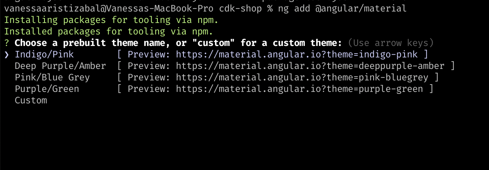

# Tienda - CDK

## 1. Crea tu  App usando el angular-cli

Para crear nuestra aplicación debemos tener instalado node.js, npm y un IDE \(Visual Studio Code es una buena opción\). 

Una vez lo instales debemos en tu terminal preferida, instalar Angular usando el siguiente comando:

```bash
npm install -g @angular/cli
```

Para verificar que tienes instalado node.js antes del anterior comando, solo colocas en la terminal

```bash
node -v
npm -v
```

* Vamos a crear el workspace o ambiente de trabajo. Cuando haya terminado de instalar el angular/cli, debes ejecutar el siguiente comando:

```bash
ng new cdk-store
```

Con ese comando indicamos que queremos crear una nueva aplicación. Cuando estes instalando te va a preguntar si deseas añadir el routing, le escribes  "Y" \(seria yes\).

Te mostrá algo similar a esto:  

'Would you like to add Angular Routing?'. Eso es lo único que necesitamos decirle Y.

Cuando te pregunte por el stylescheet selecciona SCSS \(usaremos el preprocesador de SASS\).

Si deseamos evitarnos lo anterior y queremos que nuestro proyecto tenga routing y un preprocesador ejecutamos el siguiente comando, en lugar del anterior:

```typescript
ng new angular-first-steps --routing=tru --style=scss
```

Para ejecutar nuestra aplicación debemos ir a la carpeta que se genero, ejecutamos lo siguiente en la terminal:

```text
cd cdk-store
ng serve --open
```

Añadiendo el "--open" se abre automaticamente una pestaña en tu navegador por defecto, con el scafolding incluido en el angular-cli del Hola Mundo! de angular


## 2. Instalemos una Herramienta visual

Para colocar nuestra aplicación bonita, haremos uso de Angular Material, para incluir sus componentes en la creación de nuestra tienda.


Colocaremos en nuestra terminal el siguiente comando:

```bash
ng add @angular/material
```

Al ejecutar el comando te pedirá seleccionar un tema:



Ademas te preguntará si deseas incluir los estilos de la tipografia de Material:


Por último te preguntará si deseas añadir las animaciones de Angular Material, escribiremos "Y", para incluirlas.


Para incluir algunos gestos  que tienen nuestros componentes, debemos instalar hammer:

```typescript
 npm install hammerjs --save
```

Para incluir el estilo que elegimos en la instalación debemos importarlo en nuestra hoja de estilos:

```css
@import "~@angular/material/prebuilt-themes/indigo-pink.css";
```

Iremos al IDE, para abrir desde la terminal VSCode, en la terminal colocaremos el siguiente comando.

```bash
code .
```


Si obtienes un error con el comando code, debes seguir lo siguiene:

Abre VSCode y presion cmd + shift + P 

Escribimos: **Shell**

Seleccionamos: Install code in PATH

Y luego en la terminal ingresamos: code .


Si deseas leer la documentación oficial de Angular Material, lo puedes hacer usando el siguiente link: [https://material.angular.io/](https://material.angular.io/)

## 3. Añadamos algunos componentes para nuestro componente principal.

Borremos todo el contenido de nuestra vista: app.component.html y vamos a incluir un componente Toolbar de Material.

Crearemos un module material, para incluir en él todos los componentes que deseamos incluir de Angular material.

Vamos en la terminar a colocar lo siguiente:

```typescript
ng generate module material
```

o en su forma abreviada

```typescript
ng g m material
```

Lo anterior nos va a crear una nueva carpeta y un archivo:  “_src/app/material/material.module.ts_”

En nuestro nuevo archivo vamos a incluir el Toolbar, y este nuevo archivo que creamos \(material\) lo vamos a importar en nuestro app.module.ts

```typescript

import { MaterialModule } from './material/material.module';

…
@NgModule ({....
  imports: [...,
  MaterialModule,
…]
})

```

En nuestro archivo material.module.ts ,  vamos a importar el Toolbar, y a incluirlo en los imports de nuestro module. Debemos incluir nuestro componente en los export para que puedas ser reutilizado en otros lugares:


```typescript

import { MatToolbarModule } from '@angular/material/toolbar';

…
@NgModule ({....
  imports: [...,
  MatToolbarModule,
…],
exports: [...,
  MatToolbarModule,
…]
})

```


En nuestra vista app.component.html incluiremos lo siguiente: 


```markup
<mat-toolbar color='primary'>
  <span>My Store</span>
  <span class="spacer"></span>
</mat-toolbar>
```


Vamos a incluir debajo de nuestro Toolbar una sección para mostrar una lista de productos, para ello crearemos un array donde colocaremos algunos productos \(podemos usar una API de productos\), lo haremos de una forma sencilla, usando un array y mostrando los datos en unas cards en nuestra vista app.component.ts, ademas crearemos una variable para el título de nuestra tienda, usando la interpolación:


```markup
title = 'My Store';
products = [
{
    id:1,
    title: 'Camiseta',
    price: 30000,
    category: '...',
    description: 'Camiseta con el logo de la empresa, en algodón ...',
    image: 'https://via.placeholder.com/150'
},
{
    id:1,
    title: 'Llavero',
    price: 10000,
    category: '',
    description: 'Llavero del logo de la empresa ...',
    image: 'https://via.placeholder.com/150'
}
];
```


Importaremos el componente "Card" de Angular Material.


```typescript
import { MatCardModule } from '@angular/material/card';

…
@NgModule ({....
  imports: [...,
  MatToolbarModule,
  MatCardModule
…],
exports: [...,
  MatToolbarModule,
  MatCardModule
…]
})
```


En la vista app.component.html,  incluiremos la variable title usando la interpolación, ademas usaremos las etiquetas para incluir nuestras cards, en la sección products, ademas de la directiva \*ngFor, para recorrer nuestro array de productos.


```markup
<mat-toolbar color='primary'>
  <span>{{ title }}</span>
  <span class="spacer"></span>
</mat-toolbar>
<section class="products">
  <mat-card class="card" *ngFor="let product of products">
    <mat-card-header>
      <div mat-card-avatar class="header-image"></div>
      <mat-card-title>{{ product.title }}</mat-card-title>
      <mat-card-subtitle>{{ product.category }}</mat-card-subtitle>
    </mat-card-header>
    
    <mat-card-content>
      <p>
        {{ product.description }}
      </p>
      <p>
        Price: {{ product.price }}
      </p>
    </mat-card-content>
  </mat-card>
</section>
```


Incluiremos un poco de estilos en el app.component.scss


```css
.products {
    display: flex;
    flex-wrap: wrap;
    justify-content: space-around;
    margin-top: 5%;

    .card {
        width: 90%;
        @media only screen and (min-width: 860px) {  
            width: 30%;
        }
    }
}
```


## 4. Componente CDK

"**cdk**", lo incluimos ejecutando el siguiente comando en la terminal:

```bash
ng add @angular/cdk
```

Aunque al instalar Angular material, incluimos cdk.

Incluiremos el componente Drag&Drop de CDK para arrastrar nuestros productos a la sección de 'Shoping Cart', que crearemos, en nuestro module material, incluimos lo siguiente:


```typescript
import { DragDropModule } from '@angular/cdk/drag-drop';
…
@NgModule ({....
  imports: [...,
  MatToolbarModule,
  MatCardModule,
  DragDropModule
…],
exports: [...,
  MatToolbarModule,
  MatCardModule,
  DragDropModule
…]
})
```


En nuestro app.component.ts vamos a incluir la sección "shopping-cart", debajo de la sección de productos:


```markup
<section class="shopping-cart">
</section>
```


Crearemos una variable cart, que será un array, en donde iremos incluyendo los elementos que vamos seleccionando la sección de "shopping-cart".


```typescript
cart = [];
```


Reestructuraremos nuestro HTML, para incluir algunos títulos en cada sección, antes de incluir los atributos necesarios para convertir nuestra lista de productos y la de los items incluidos en nuestro cart, en un drag&drop. Nuestro HTML quedará así:

```markup
<section class="section-container">
  <h1>Products</h1>
  <div class="products">
      <mat-card class="card" *ngFor="let product of products">
        <mat-card-header>
          <div mat-card-avatar class="header-image"></div>
          <mat-card-title>{{ product.title }}</mat-card-title>
          <mat-card-subtitle>{{ product.category }}</mat-card-subtitle>
        </mat-card-header>
        
        <mat-card-content>
          <p>
            {{ product.description }}
          </p>
          <p>
            Price: {{ product.price }}
          </p>
        </mat-card-content>
      </mat-card>
  </div>
</section>
<section class="section-container">
  <h1>Shopping Cart</h1>
  <div class="shopping-cart">
  </div>
</section>
```

En la sección de "shopping-cart" vamos a incluir algunas etiquetas para añadir unas cards que mostrarán los elementos que vamos incluyendo en nuestro shopping-cart.


```markup
<section class="section-container">
  <h1>Shopping Cart</h1>
  <div class="shopping-cart">
    <mat-card class="card" *ngFor="let item of cart">
        <mat-card-header>
          <div mat-card-avatar class="header-image"></div>
          <mat-card-title>{{ item.title }}</mat-card-title>
          <mat-card-subtitle>{{ item.category }}</mat-card-subtitle>
        </mat-card-header>
        
        <mat-card-content>
          <p>
            {{ item.description }}
          </p>
          <p>
            Price: {{ item.price }}
          </p>
        </mat-card-content>
      </mat-card>
  </div>
</section>
```


Debemos importar en nuestro component: app.component.ts, los elementos que usaremos:


```typescript
import { CdkDragDrop, moveItemInArray, transferArrayItem } from '@angular/cdk/drag-drop';
```


Crearemos un contenedor para incluir nuestras dos secciones, e incluiremos la directiva "**`cdkDropListGroup`** " para que se puedan conectar nuestras dos listas que se convertirán en drag&drop.


```markup
<mat-toolbar color='primary'>
  <span>{{ title }}</span>
  <span class="spacer"></span>
</mat-toolbar>
<div cdkDropListGroup class="store">
  <section class="section-container">
    <h1>Products</h1>
    <div class="products">
     ...
    </div>
  </section>
  <section class="section-container">
    <h1>Shopping Cart</h1>
    <div class="shopping-cart">
      ...
    </div>
  </section>
</div>
```


Para que nuestras cards se puedan arrastrar es necesario agregar la directiva " **`cdkDrag`** " en nuestras &lt;mat-card&gt;&lt;/mat-card&gt;


```markup
...
<mat-card class="card" *ngFor="let product of products" cdkDrag>
</mat-card>
...

<mat-card class="card" *ngFor="let item of cart" cdkDrag>
</mat-card>
...

```


Para restringir donde iremos colocando nuestros elementos es necesario que en nuestras etiquetas &lt;section&gt;&lt;/section&gt;, se le añada la directiva: "**`cdkDropList`** " .

Para asociar los datos del " **`cdkDrag`** " y del "**`cdkDropList`** " , se podia hacer uso del  "**`cdkDropListData`**", para que al disparar el evento desde ambas directivas, se pueda identificar el origen de la interacción de arrastrar o soltar. 

`cdkDropList` se le asigna sus arrays de elementos respectivos. Nada de lo anterior actualiza el modelo de datos, para ello se  escucha el evento  "**`cdkDropListDropped`**" para actualizar el modelo de datos una vez que se termine de arrastrar. 

Incluiremos como mencione en los &lt;section&gt;&lt;/section&gt; las directivas y el evento, que nos permitirá actualizar el modelo.


```markup
...
<section 
    class="section-container"
    cdkDropList
    [cdkDropListData]="products"
    (cdkDropListDropped)="drop($event)"
>
    <h1>Products</h1>
        ...
</section>
...

...
<section 
    class="section-container"
    cdkDropList
    [cdkDropListData]="cart"
    (cdkDropListDropped)="drop($event)"
 >
    <h1>Shopping Cart</h1>
        ...
</section>
...
```


Incluiremos algunos estilos, para organizar nuestro elementos:


```css

.store {
    display: flex;
    flex-direction: row;
    .section-container {
        border: 1px solid lightgray;
        border-radius: 15px;
        margin: 5% 1%;
        padding: 2em;
        width: 50%;
    }
    .products,
    .shopping-cart {
        align-items: center;
        display: flex;
        flex-wrap: wrap;
        justify-content: space-around;
        .card {
            width: 90%;
            @media only screen and (min-width: 860px) {  
                width: 30%;
            }
        }
    }
}
```


Añadiremos en nuestro component la función drop\(\), donde le asignaremos como parametro de entrada el evento de tipo **`cdkDragDrop`**. Es un evento emitido cuando se suelta un elemento que se puede arrastrar dentro de un contenedor de colocación.

En nuestra función incluiremos un condicional para preguntar si el evento del contenedor anterior es igual al contenedor actual.  

En el condicional usaremos el **`moveItemInArray`**, mueve un elemento de un indice de un  array a otro, y el **`transferArrayItem`**, que mueve un elemento de un array a otro.


```typescript
drop(event: CdkDragDrop<any[]>) {
    if (event.previousContainer === event.container) {
      moveItemInArray(event.container.data, event.previousIndex, event.currentIndex);
    } else {
      transferArrayItem(event.previousContainer.data,
                        event.container.data,
                        event.previousIndex,
                        event.currentIndex);
    }
  }
```


Ahora nuestra tienda en una forma básica esta lista, si arrastramos y soltamos nuestros elementos, de una sección a otra podremos ver nuestro drag&drop en funcionamiento. 


Incluiremos un botón \(Comprar\) que será visible cuando tengamos elementos en la sección de "shopping-cart". Cuando demos click en el botón se llamará una función donde mostraremos una función con la lista de los títulos de nuestros productos.


```markup
<section 
    class="section-container"
    cdkDropList
    [cdkDropListData]="cart"
    (cdkDropListDropped)="drop($event)"
  >
    <h1>Shopping Cart</h1>
    <div class="shopping-cart">
      ...
    </div>
    <button type="button" mat-raised-button color="primary" (click)="buy()">Comprar</button>
  </section>
```


Para la lista importaremos el MatListModule, en el module de material: material.module.ts


```typescript
import { MatListModule } from '@angular/material/list';
…
@NgModule ({....
  imports: [...,
  MatToolbarModule,
  MatCardModule,
  DragDropModule,
  MatListModule
…],
exports: [...,
  MatToolbarModule,
  MatCardModule,
  DragDropModule,
  MatListModule
…]
})
```


En nuestro HTML incluiremos la lista y usaremos la directiva \*ngIf para hacer visible nuestra lista cuando presionemos sobre el botón Comprar.


```markup
<div *ngIf="itemsToBuy" class="message"> 
  <h2>{{ message }}</h2>
  <mat-list role="list">
    <mat-list-item role="listitem" *ngFor="let item of cart">{{ item.title }}</mat-list-item>
  </mat-list>
</div>
```


En nuestro componente, en nuestra lógica incluiremos la siguiente función:


```typescript
itemsToBuy: boolean = false;
message: string = '';
buy(){
  if(this.cart.length > 0){
    this.itemsToBuy = true;
    this.message = "Elements to buy";
  }else{
    this.itemsToBuy = false;
  }
}
```


Incluiremos un poco de estilos:


```css
.message {
    border: 1px solid lightgray;
    border-radius: 15px;
    margin: 5% 1%;
    padding: 2em;
}
```



Para ver más detalles de la documentación del Drag&Drop, se puede revisar en el siguiente link: [https://material.angular.io/cdk/drag-drop/overview](https://material.angular.io/cdk/drag-drop/overview)

Puedes ver el repo de este mini proyecto en la siguiente url: [https://github.com/vanessamarely/cdk-store](https://github.com/vanessamarely/cdk-store)


