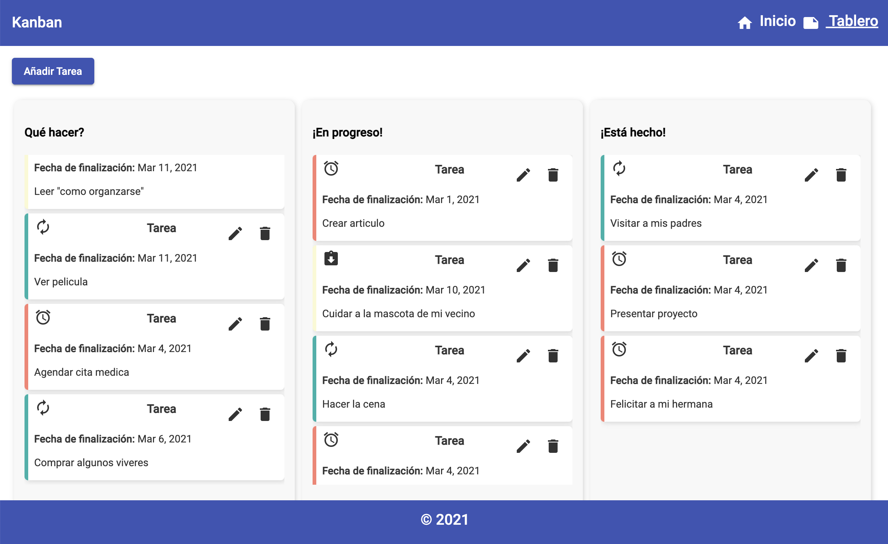
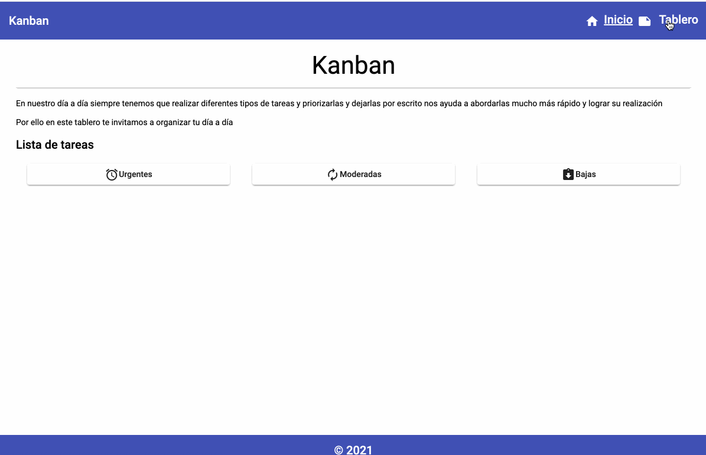

# Kanban Board

## Proyecto: Board o Tablero 📋

Durante el día siempre tienes que ejecutar diferentes tipos de tareas, y con este tablero podrás crear tu propio espacio donde las podrás tener de forma organizada,  colocarles una prioridad y una fecha en la que esperas culminarla. 

El tablero tendrá tres secciones una las tareas creadas y por hacer, otra que estas en progreso  y la última sección tareas finalizadas.

Lo mejor es que podrás personalizar tu tablero y hacer volar tu imaginación para crear el mejor administrador de tareas.

### Indice

1. Arquitectura

*  Guia de estilos
* Recomendaciones generales
* Arquitectura de componentes
* Arquitectura Modular

     2. Creando el Kanban Board

Para el proyecto vamos a emplear varios conceptos básicos de Angular, iniciaremos hablando de un poco de arquitectura, los componentes. Usaremos Angular material, algunos de sus componentes y tambien haremos uso del CDK.

Lo ideal es lograr hacer una aplicación como esta, aunque tú la puedes hacer más bonita.

