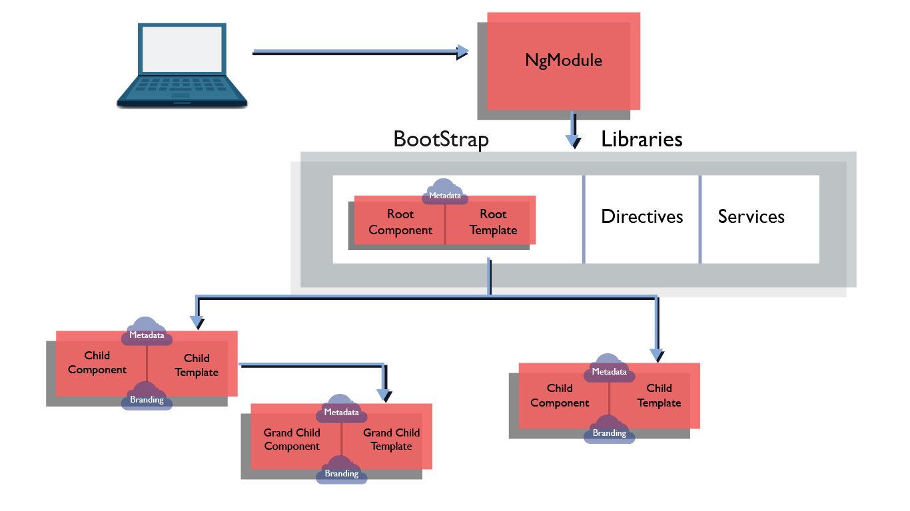
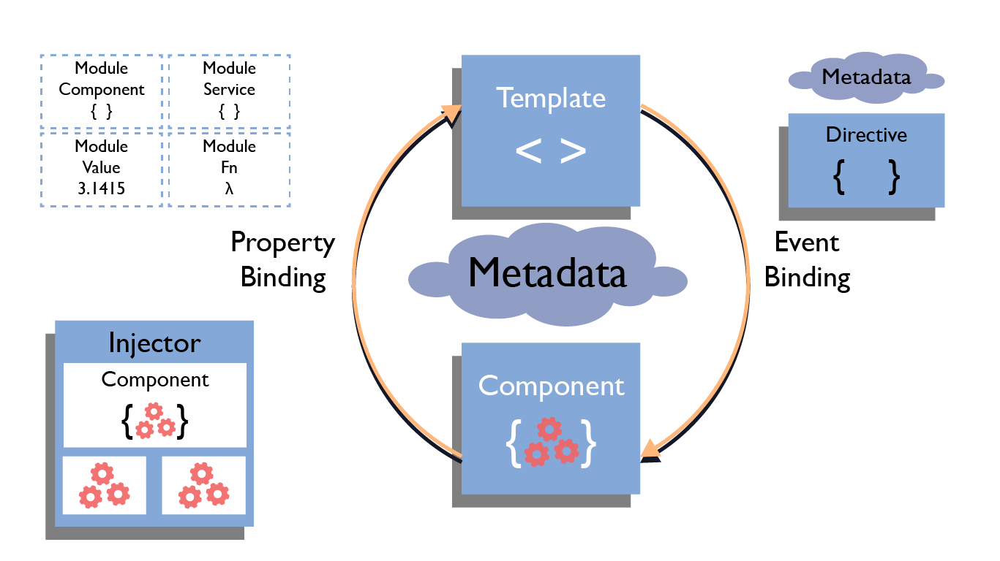

# Arquitectura

Según la documentación oficial de Angular, la arquitectura de una aplicación en Angular, se basa en ciertos conceptos fundamentales. Los bloques de construcción básicos del marco angular son componentes angulares que están organizados en NgModules. 

NgModules recopila código relacionado en conjuntos funcionales; una aplicación de Angular está definida por un conjunto de NgModules. Una aplicación siempre tiene al menos un módulo raíz que permite el arranque y, por lo general, tiene muchos más módulos de funciones.

Siguiendo este marco de Angular hay unos conceptos básicos que es fundamental aprender para crear nuestras aplicaciones como son: Módulos, Componentes, Servicios; que en conjunto con otros conceptos como Routing, Schematics, Directivas, Formularios y algunos patrones \(DI\), entre otros, nos ayudan a crear nuestras aplicaciones en Angular.

Basado en ese marco inicial, en la página oficial podemos encontrar un diagrama, que enseña cómo se relacionan estas piezas básicas y de esta forma vamos armando nuestro rompecabezas o nuestra aplicación de legos.

Los conceptos claves de la arquitectura en Angular son:

* La estructura de Módulos
* Organización de los Componentes
* Librerías personalizadas \(Rehusar algún componente o servicio a través de toda la aplicación o entre aplicaciones\)
* Técnicas de comunicación entre componentes
* RxJS \(Observables\)
* State Management  o Administración el estado
* Decoradores personalizados, Pipes, entre otros.

Podemos usar esos conceptos o alguno de ellos,  para crear una aplicación con una buena arquitectura.

No hay una única forma de crear la arquitectura de nuestra Aplicación, pero lo más importante es KISS, y no me refiero a una banda de rock.

"Keep It Simple, Stupid" ó "Mantenerlo Simple" \(La última palabra sobra en su traducción\)

La idea de este principio es crear soluciones que nosotros y otros puedan entender.

Hay una frase muy útil de recordar de  **Martin Fowler**:

> _“Cualquiera puede escribir código que una máquina pueda entender. Pero solamente un buen programador es capaz de escribir código que otras personas también entiendan”_

Tips alusivos de este principio son:

* **Mantener los métodos y Clases pequeñas** \(pocas líneas de código\). Una vez un desarrollador me dijo que una buena forma es por archivo intentar crear hasta 100 líneas, si me pasaba de esa meta es posible que mi código necesitaba ser refactorizado o había alguna funcionalidad en ella que estaría mejor ubicada en otro lugar.
* **Nombres Claros para nuestras variables, métodos o funciones y clases**. Es bueno usar nombres que sean lo suficientemente claros para no necesitar comentarios que expliquen qué se pretende hacer.
* **No reutilizar variables o dar dos significados a una variable**. Es bueno evitar **shadowing** o **sombreado**, en nuestras variables o darle demasiadas funciones a una, para evitar confusiones.
* **Dividir el problema en partes más pequeñas**. Encontrar la solución a problemas es nuestro objetivo, a veces tomamos el todo y en lugar de dar soluciones a partes particulares. Es bueno dividirlo para prestar atención al detalle y poder analizar diferentes aspectos.
* **No abusar de los comentarios**. Si requieres documentar mucho de tu código, quiere decir que tal vez no es lo suficientemente entendible para otros desarrolladores. Es bueno hacer pequeños comentarios, solo si es necesario, lo ideal es que tus funciones y variables sean claros, como se mencionó antes.
* **Evitar la duplicidad**.  ****Es recomendable que cuando veas código duplicado crees una solución reusable de ello, es bueno evitar copiar y pegar el código en diferentes lugares para ahorrar tiempo.
* Aplicar más principios. Como el principio **SOLID**. 

### Aspectos a considerar en la Arquitectura

**Antes de construir una aplicación debemos pensar en ciertos aspectos importantes que son necesarios, e incluso hablando desde un rol diferente a desarrolladores, como arquitectos de un edificio, debemos seguir los planos; pero en una aplicación no tenemos un único plano para construir nuestra aplicación de esa forma.**  

Pero es importante tener en cuenta lo siguiente:

* **Visión general de nuestra aplicación.** Conocer los objetivos, para qué se va a usar la aplicación, como la van a usar, entre otros aspectos que nos sirvan para darnos una gran idea de lo que vamos a construir. Analizar todos los requerimientos.
* **Features o características de la aplicación.** Es muy importante listar todas las características. Usuarios, Login, Empresa, entre otros.
* **Domain security o seguridad del dominio.** Habla de la seguridad, reglas en el servidor, como será la comunicación de nuestra API en la aplicación, se va a usar un Token \(**HttpInterceptor**\), o que otro método.
* **Domain Rules o Reglas de Dominio**. Se van a seguir algunas reglas en el lado del cliente o todas del lado del servidor, será en ambos? y qué sobre la validación?
* **Logging.** Se van a mostrar los errores en la consola? o tal vez en el LocalStorage? se va a manejar una API para la autenticación o vamos a integrar nuestra aplicación con alguna librería, third-party option o servicio en la nube?
* **Comunicación con los servicios.** Como nuestra aplicación se va a comunicar con el servidor? HTTP? Web Sockets? Restful services
* **Modelos de Datos.** ¿Qué va a pasar en los componentes? estamos obteniendo lo que necesitamos en la API? ¿Cómo podemos obtener una pequeña parte de todo lo que obtenemos en la API?
* **Features Components o Características de Componentes.** como vamos a organizar nuestros componentes, vamos a usar el patrón presentacional. ¿Cómo vamos a manejar la comunicación entre componentes?
* **Shared Functionality o funcionalidad compartida.** tenemos que definir varios aspectos sobre la aplicación, si vamos a compartir diferentes funcionalidades a lo largo de nuestra app. Componentes como un menú, un modal o 3rd party libraries: Material, NGPrime, otra.

Se pueden definir muchas más consideraciones, pero las anteriores podrían ser nuestra base, la forma en cómo crearemos el mapa de la arquitectura de nuestra aplicación. 

