# Arquitectura de Componentes

La mayoría de aplicaciones que construimos no son paginas estáticas, hay un estado y hay diferentes tipos de componentes donde el estado podría vivir. 

### Tipos de Componentes

* Presentational componentes o Componentes de presentación

Muy conocidos como Dumb o componentes tontos. Son stateless o sin estado y usan Inputs/Outputs para su comunicación. Enviamos un valor, renderizamos los valores, emite un evento cuando esta listo y algún otro componente administra el estado y hace las actualizaciones respectivas del estado. 

Con estos componentes nos probamos a nosotros mismos en cuanto a la separación de la complejidad en la lógica que podemos llegar hacer, en estos componentes no hay necesidad de crear servicios mockeados, o hacer alguna petición solo pasamos los inputs, se verifica alguna información de ser necesaria y se emite un output

* Container components o Componentes contenedores

Estos componentes son los Smart o inteligentes. Se encargan de conector los "Dumb" al estado de la aplicación. Maneja los eventos emitidos, el de presentación emite un evento, y este  responde a ese evento y se hace los llamados al servidor y actualiza lo necesario para ver los cambios necesarios en la UI o interfaz de usuario. El contenedor es el que controla todo el el administrador, se encarga interactuar con los servicios o el state Management.

* Layout components o componentes de diseño

Para estos no se maneja data, por lo que no es necesario una actualización cuando hay un cambio. Lo podemos ver como una página que tiene una estructura definida, o una plantilla que nos servirá para luego organizar otros componentes.

### Flujo de datos

cuando estamos creando nuestra aplicación podemos ubicar los tres tipos de componentes de la siguiente forma:

Container \(Contenedor\)     -&gt;        Layout \(Diseño\)      -&gt;     Presentational \(Presentación\)

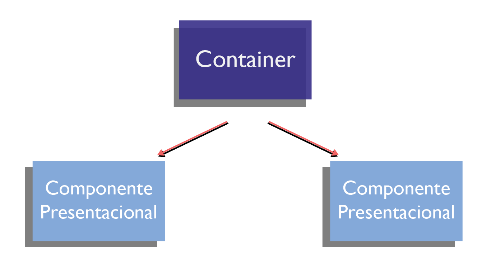

Entre el contenedor y el componente de presentación, una forma de compartir la data es mediante Input y Outputs.

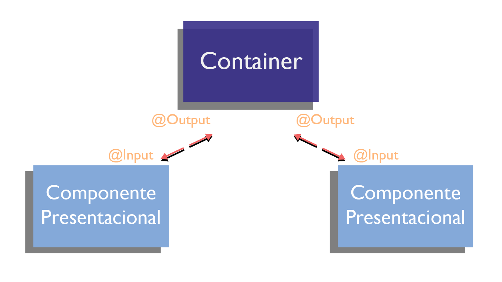

Un contenedor puede ser un componente padre, pero tambien un componente presentacional podría serlo, sin modificar el estado y solo compartiendo la información con sus hijos que viene desde un padre contenedor.

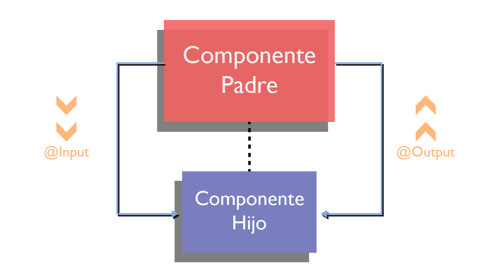

El Input nos permite pasar una data como entrada a nuestro componente, comúnmente la usamos para pasar data entre padres a hijos, si necesitáramos pasar desde el hijo al padre, usaríamos el Output.

La data viene de una petición como por el HttpClient, una Store \(NgrX\), o una ruta y todo va al contenedor, esas diferentes fuentes van al contenedor y este hace lo que requiere el estado y lo pasa al componente presentacional, para renderizar lo que se necesita. 

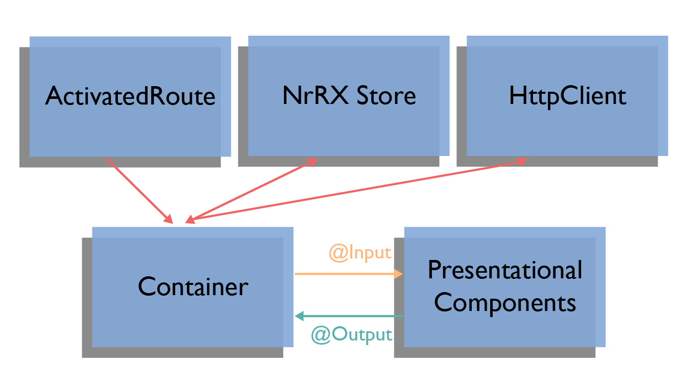

Son dos componentes los importantes uno en mostrar el contenido y el otro de manejar la data.

#### Estrategias de Change Detection

OnPush causa que el "Change Detection" e ejecute cuando:

* Una propiedad de Input cambia de referencia
* Una propiedad de Output/EventEmitter o DOM dispara un evento
* Async Pipes reciben un evento
* Change Detection is manualmente invocado por el ChangeDetectorRef

Beneficios del OnPush

* Optimización \(los componentes no están verificados hasta que se cumpla una condición del OnPush\)
* Prevenir que los componentes de presentación actualicen el estado que deberían obtener del contenedor/padre

#### Otra forma de comunicar componentes

Con el Input y Output tenemos una buena comunicación entre los componentes, pero cuando incrementa la complejidad de nuestra aplicación y se necesita una mayor jerarquía, se puede volver algo complejo usar esta forma conocida y es necesario usar otras técnicas de comunicación.

* Event Bus. Es un patrón mediador, el servicio actúa como un intermediario entre los componentes. Los componentes no saben de donde viene la data y es débilmente acoplado. Se basa en Subject/observable.

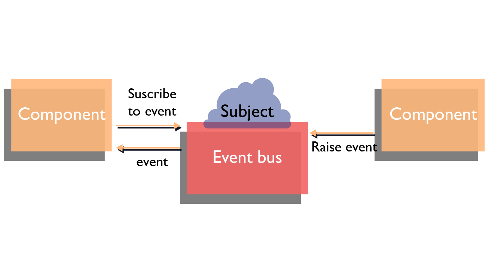

* Observable service. Proviene del patrón Observer. El servicio expone un observable directamente a los componentes. Los componentes saben de donde proviene la data, no es débilmente acoplado como el Event bus. Se basa en Subjects/observable.

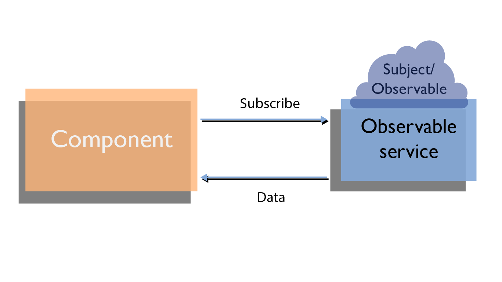


**RxJS** es una librería de programación reactiva, basada en eventos a través de secuencias de observables.


**RxJS Subjects**

* Subject. Los subject proporcionan una manera de enviar uno a más datos a los oyentes. Estos oyentes están subscritos y obtiene la información. En el caso de haber nuevos subscriptores estos no obtendrán la data que se paso antes a los oyentes, solo los nuevos obtienen la data que se está transmitiendo desde el momento de la subscripción.

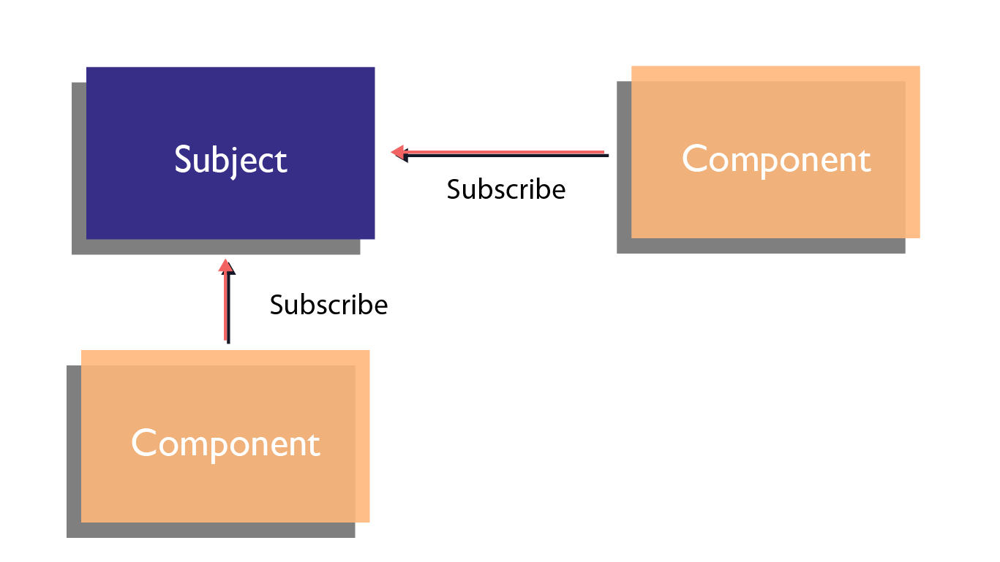

* BehaviorSubject. Es muy similar a los subject, con la diferencia que los nuevos suscriptores pueden obtener la última información que se haya pasado previamente a su subscripción. 

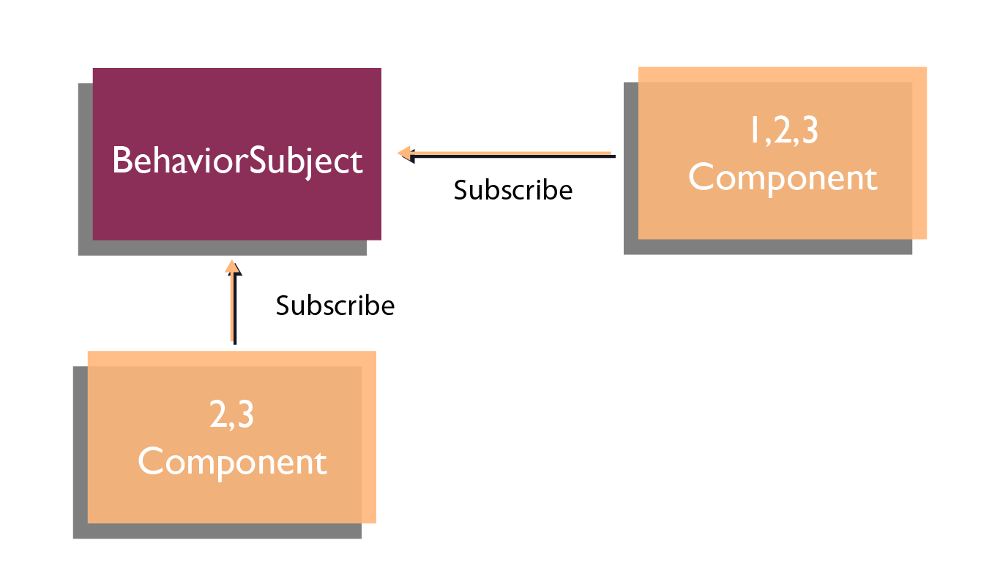

* ReplaySubject. Este es una especia de BehaviorSubject, este puede repetir el ultimo valor que haya sido pasado al momento de la suscripción e incluso se puede configurar si se desea pasar valores anteriores. 

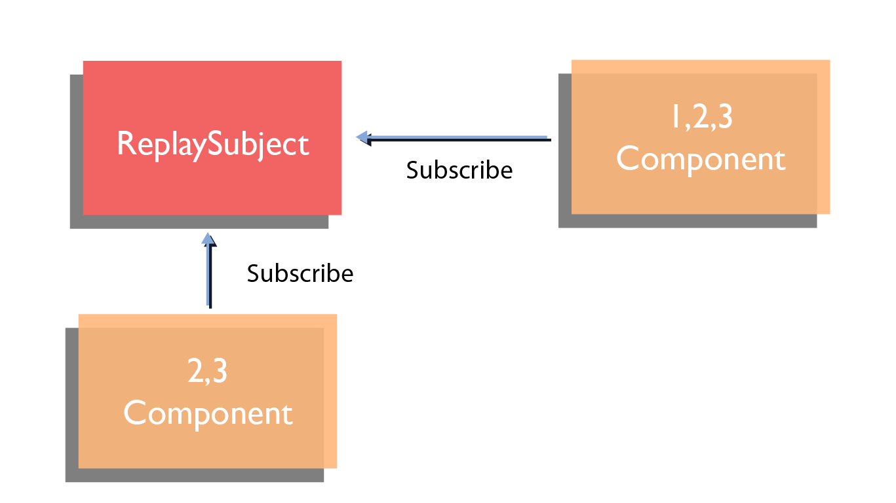

* AsyncSubject. Este es diferente a los demás, con el se pasa el valor más actualizado

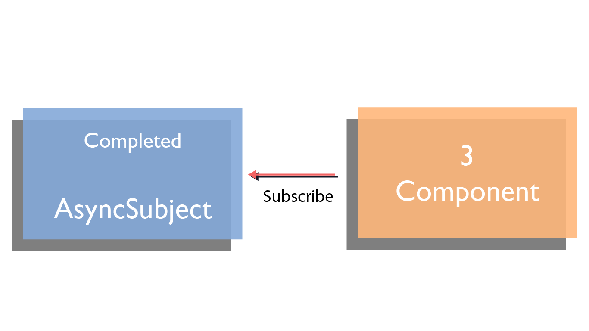

###  Porqué necesitamos un estado?

Se tiene un servidor que tiene un valor,  se puede tener las rutas que trae data que se comparte entre ellas, y se muestra esa data en la página. Necesitamos la data proveniente de algún lugar para mostrarla en otro; y el estado es quién se encarga de ayudarnos en la comunicación de esas dos necesidades, se puede decir que es la interface entre los datos y los componentes. Ademas nos ayuda a tener los datos consistentes entre componentes y a mantener la comunicación entre ellos.

###  Tipos de Estados

* Estado del servidor

El estado del servidor es la data en el Backend. Hacemos peticiones de la data  al servidor, mediante puede ser un HttpCliente o una url y hacemos la petición de la data. 

* Estado de la aplicación

El estado de la aplicación es lo que nos ayuda a persistir la data a través de toda la aplicación

* Estado de la página

El estado de la página es lo que solo es necesario en la página.

En este punto llega un gran interrogante, como saber cual debemos usar o como debemos poner la data?

Y debemos hacer una análisis del diseño de nuestra aplicación en este punto nos preguntamos, debo compartir la data en toda la aplicación?, la necesito en ciertas páginas?, cuanto debe durar la persistencia de la data? la comparto en una sesión o debe ser en múltiples? 

Tenemos varias opciones para responder a nuestras preguntas anteriores.

* Servicios. usando el patrón singleton, podemos crear un subject, exponemos un observable, donde se pueden subscribir a él, puedo obtener lo que necesito y si necesito hacer un update llamo a un set para que se encargue de la actualización. Todos los que se hayan subscrito obtendrán el estado correspondiente, este método ayuda a mantener una consistencia.
* Librerías para manejar el estado  \(NGRX, NGXS\)
* Router o Enrutamiento. Almacena la persistencia de la data, permitiendo que exista en una sesión y también permite compartir paginas o rutas. En el enrutamiento podemos compartir parámetros que usaremos a través de la aplicación.
* Estado del componente. Smart component se encarga de manejar todo el estado.

#### State Management

Depende del desarrollo de nuestra aplicación, podemos optar por esta opción de necesitar un _**State Management**_. Los objetivos de este son:

* Una sola fuente de verdad
* Predecible
* Inmutable
* Seguimiento a los cambios

Para manejar el estado existen varios opciones:

* **Servicios**. Es un buen punto de entrada para manejar el estado de la aplicación. Desde la documentación oficial un servicio es una clase con un propósito limitado y bien definido. Puede ayudarnos para la comunicación del flujo de datos de una forma sencilla. Los podemos incluir mediante la inyección de dependencias en donde los necesitemos y podemos proveer notificaciones usando los Subjects, es fácil de mantener y realizar una simple petición al servidor. Pero cuando la aplicación empieza a crecer y ser un poco más robusta, podemos continuar usando los servicios, pero es necesario centralizar la información en un _**Sto**_**re**.Los servicios se comunican con la Store y de esta forma se garantiza la comunicación con el estado. 

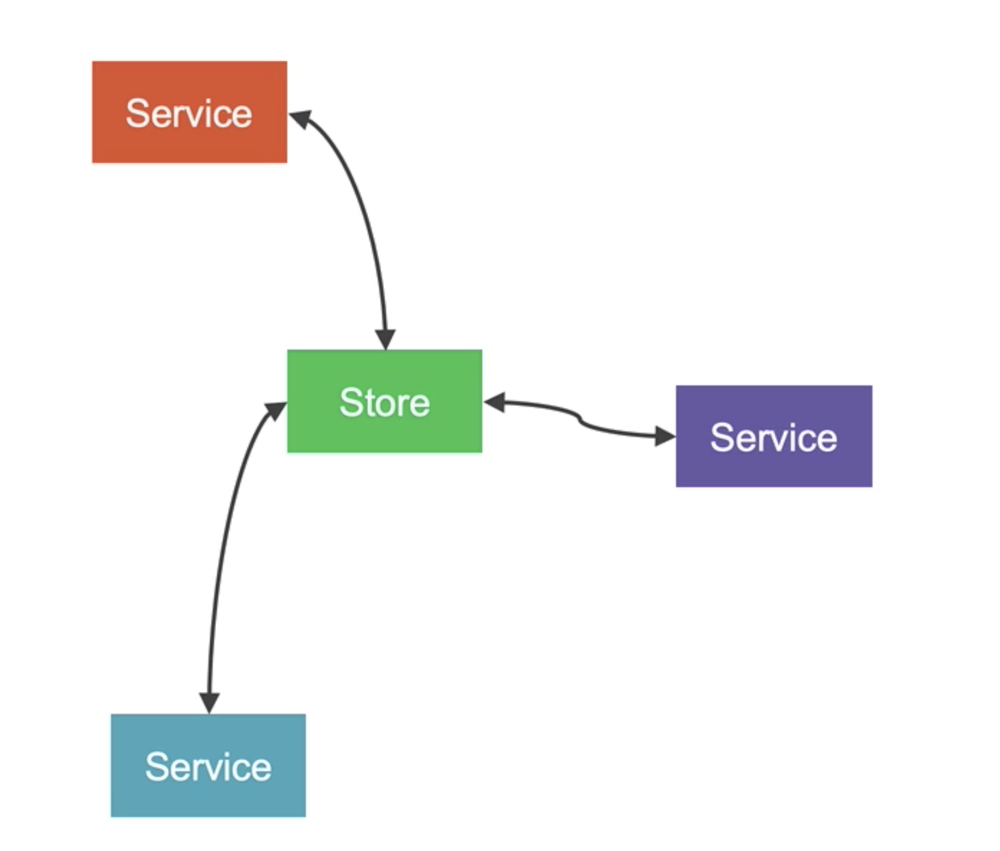

* **NgRx Store**. provee un manejo del estado reactivo para las aplicaciones de Angular, inspirado por Redux. Unifica los eventos en la aplicación y dirige el estado usando RxJS. 


**Redux + RxJS = NgRx**


-- Provee una sola fuente de verdad para el estado. 

-- Provee datos inmutables, los datos no van a mutar o cambiar en multiples lugares a través de la aplicación. 

-- Provee una consistencia a través del equipo de desarrolladores y podemos tener una buena experiencia en el debugging de la app.

En NgRX tendremos una Store, que será responsable por el almacenamiento del estado de la aplicación, puede ser cualquier tipo de estado \(Estado de la aplicación, estado de la sesión, o estado de la entidad\). 

Para interactuar con el Store y el estado se tienen **Acciones**, las acciones se pasan a los **Reducers**, que son básicamente traductores que toman las acciones, actúan sobre ellos y luego interactúan con el store del estado. Para obtener esa data en nuestro componente, tenemos los **Selectores** \(**Selectors$**\). 

Para obtener la data del servidor, el **componente** llama a una acción, que dispara un **Effect**, que luego se integra al **servidor** y obtiene la data de él. Cuando el E**ffect**, obtiene la data de regreso, envía la acción correspondiente \(**Action**\), va al **Reducer**, el cual actualiza la data del S**tore**, y luego el selector obtiene esa data de regreso al **Componente**.

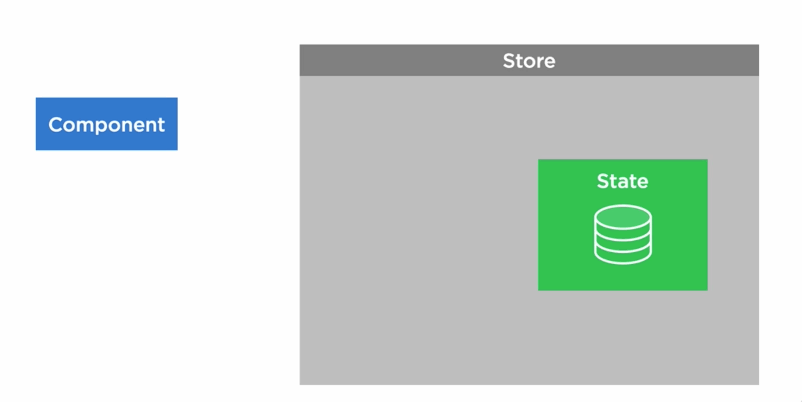

Usar NgRx es muy útil en nuestras aplicaciones añade un poco más de complejidad y más código, pero sí se define bien el patrón es bueno para el equipo y para el proyecto a futuro. Tiene una pequeña curva de aprendizaje

* **ngrx-data**. Extension de la funcionalidad de NgRX. Ofrece una suave introducción a ngrx/redux sin el boilerplate. Simplifica el NgRx. 

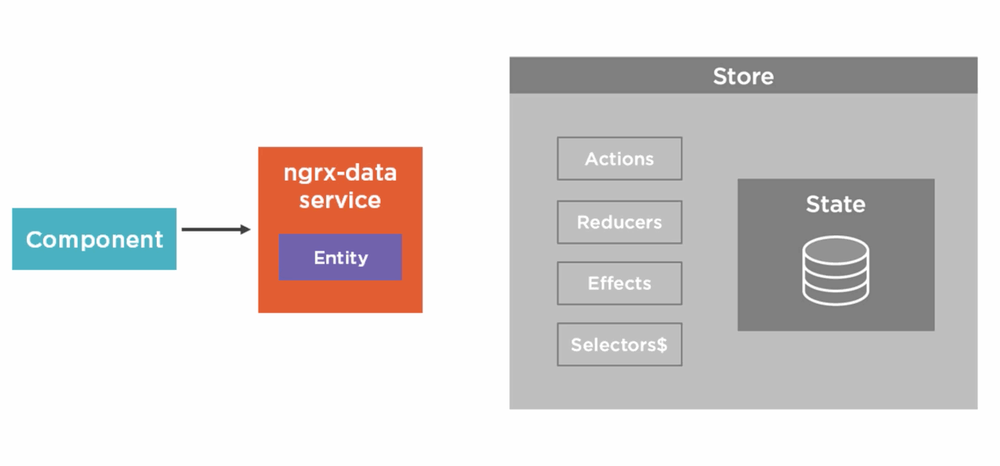

* **Observable Store**. Provee una forma de administrar el estado de nuestra aplicación, mientras se logran muchos de los objetivos que ofrecen otros state management complejos. Entre los objetivos de este Observable Store, esta el ser una sola fuente de verdad, el estado es solo de lectura e inmutable, provee notificaciones del cambio de estado a los subscriptores; también tiene la posibilidad de hacer un seguimiento al historial del cambio de estado y por ultimo una minima cantidad de código es requerida. Trabaja con cualquier librería. 

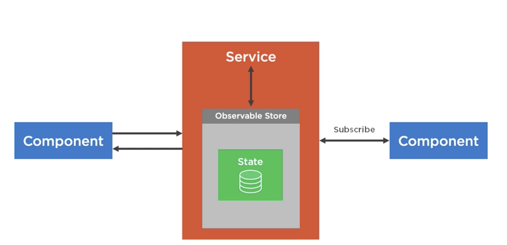

* **Akita**
* **Ngxs**
* **Mobx**
* Entre otras.

### Cómo definimos la arquitectura de nuestra aplicación?

* Analiza los requerimientos. Necesitamos hacer un análisis de lo que se desea hacer, es posible que nuestra aplicación crezca y se deba reestructurar, pero de los requerimientos actuales se debe pensar en crear código, que no posea mucha complejidad, que se pueda escalar y que los nuevos integrantes del equipo puedan entender, para que sean participes activos de la aplicación.
* Fácil de mantener. Es este punto ayuda mucho el anterior, es bueno pensar en componentes aislados en su lógica, pero aveces de la prisa lo olvidamos, es bueno siempre recordar que la aplicación va a crecer y se debe hacer un alto a tiempo en el código y pensar en una solución que sea entendible y fácil de mantener para todos.
* Desarrollar funciones o características que  nos ayuden a estructurar la aplicación, donde algunas ayudan al mantenimiento del estado de la aplicación.
* Se debe definir el alcance del estado, no todos los estados deben ser visibles en toda la aplicación, es bueno aprender a ubicar de acuerdo al tipo de estado su lugar correcto
* Separar el contenedor de la presentación, se debe definir que componente es solo para mostrar información que no tendrá lógica compleja y cual se encargara de manejar la lógica a mostrar en el presentacional.

