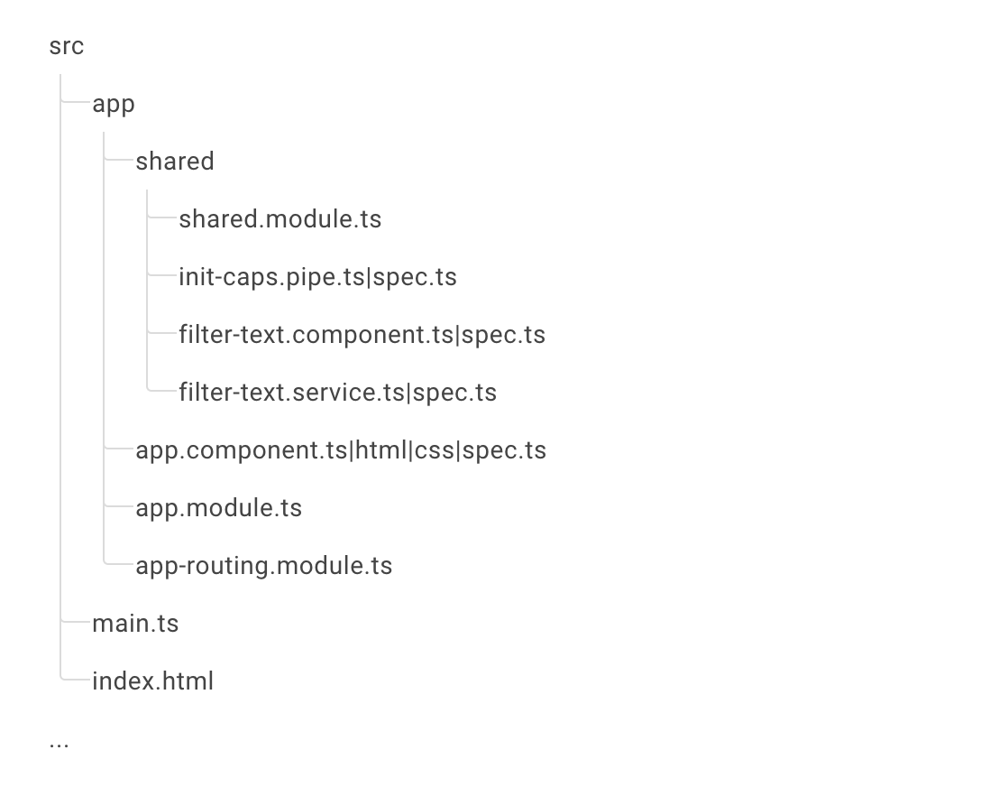

# Arquitectura Modular

A la hora de organizar nuestro código deseamos que nuestra aplicación sea escalable y limpia, y en esa escalabilidad nos ayuda encontrar una estructura de carpetas adecuada para nuestro proyecto.

El tener una estructura bien definida nos ayuda a ubicar los diferentes elementos que vamos a ir creando, y nos da una mejor visibilidad.

Cada estructura varia, como cada proyecto o aplicación, antes de crear nuestros componentes, módulos, servicios, etc., tenemos que tener claro cuál será la responsabilidad que este va a tener. En la guía de estilo menciona todas estas prácticas en las que nos podemos basar para lograr esto.

De acuerdo a nuestro proyecto podemos tener diferentes formas de organizar nuestros archivos, sea crear módulos por cada feature que vaya a tener nuestra aplicación, o incluso crear módulos, donde agruparemos ciertos elementos de acuerdo a su uso, si es común, o compartido.

Algo super importante antes de estructurar nuestro proyecto son las guías de estilo y en ella habla de los más importante y el el principio **LIFT**, no se debe tener toda la experiencia del mundo para crear una aplicación, pero si sigues la guía en especial sus principios, vas a crear una muy buena aplicación y por ende un buen producto.


LIFT es un principio

**Locating -** localizar el código facilmente

**Identify -** Identificar el código desde la primera vez que lo veas 

**Flattest -** Estructura más plana

**Try -** Intentar el Dry


Comúnmente se tienen los siguientes módulos en las aplicaciones:

* Core: El CoreModule, asume el rol de AppModule raíz, tendrá aquellos componentes universales y otras características donde solo hay una instancia por aplicación, servicios Singleton, entre otros.
* Share: El SharedModule es donde deben ir todos los componentes, pipes/filters y directivas compartidas en nuestra aplicación. El SharedModule se puede importar en cualquier otro módulo cuando esos elementos se reutilicen. El módulo compartido no debería depender del resto de la aplicación y, por lo tanto, no debería depender de ningún otro módulo.
* Feature: Para aquellos componentes que realizan una funcionalidad especifica en el proyecto.

En la documentación de Angular, podemos ver un ejemplo sencillo del uso de los modelos mencionados:

## Estructurando nuestra aplicación

Si tenemos en cuenta el proyecto que vamos a construir , podemos pensar en el concepto de tener una aplicación con una arquitectura modular o por features, por qué podemos definir que el home sea un feature y el tablero o board sea otro feature, etc.

Iniciando con la planeación o el mapa que había mencionado antes, para construir el Kanban, tal vez no vayamos a usar todos los puntos mencionados anteriormente, pero podemos iniciar respondiendo a lo siguiente que va a ser realmente lo que abordaremos:

* **Visión general de nuestra aplicación**, el objetivo será construir un Kanban o tablero, en el contaremos con dos secciones principales una donde crearemos las tareas, en esta sección iremos moviendo las tareas de acuerdo al cambio de estado de ella, podemos crear un modal para crear la tarea, en la sección del home podemos ver un resumen del estado de nuestras tareas.
* **Features o características de la aplicación**. Board, Home y componentes compartidos como una card que puede usarse para ver la tarea.
* **Comunicación con los servicios**. Usaremos data mockeada, nuestros servicios nos permitirán compartir funcionalidades.
* **Modelos de Datos**. Entre los componentes pasaremos información mockeada.
* **Features Components o Características de Componentes**. Algunos componentes serán de presentación como la card para visualizar la tarea.
* **Shared Functionality o funcionalidad compartida**. El Header, menu y footer serán componentes que usaremos en toda la aplicación y de uso compartido entre las secciones. 3rd party libraries: Usaremos Angular Material y algunos componentes del CDK.

Este proyecto será local en nuestra maquina, no haremos un despliegue así que no pensaremos en la seguridad, autenticación, no tendremos un login; pero de dar un mayor alcance a nivel personal o empresarial, es bueno que pienses en los siguientes aspectos:

* **Domain security o seguridad del dominio**. 
* **Domain Rules o Reglas de Dominio**. 
* **Logging**. 
* **Comunicación con los servicios**. 

\*\*\*\*

