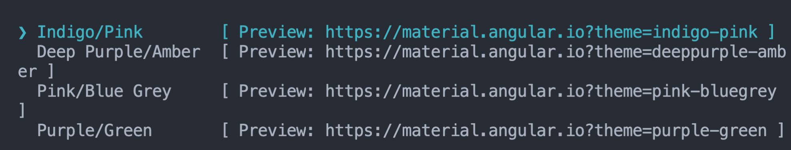
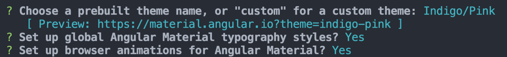
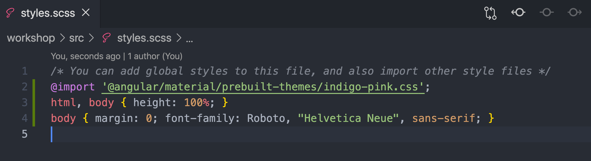
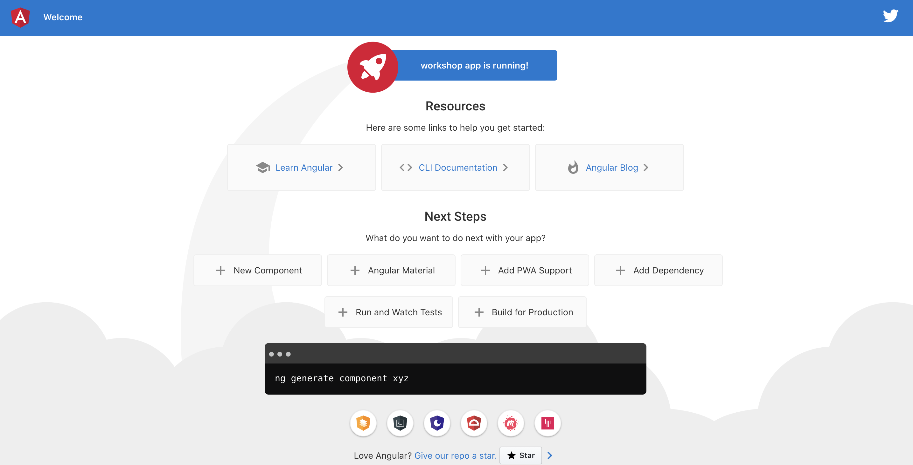
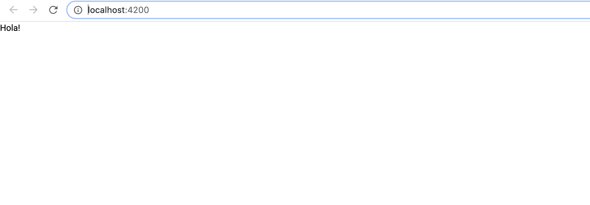
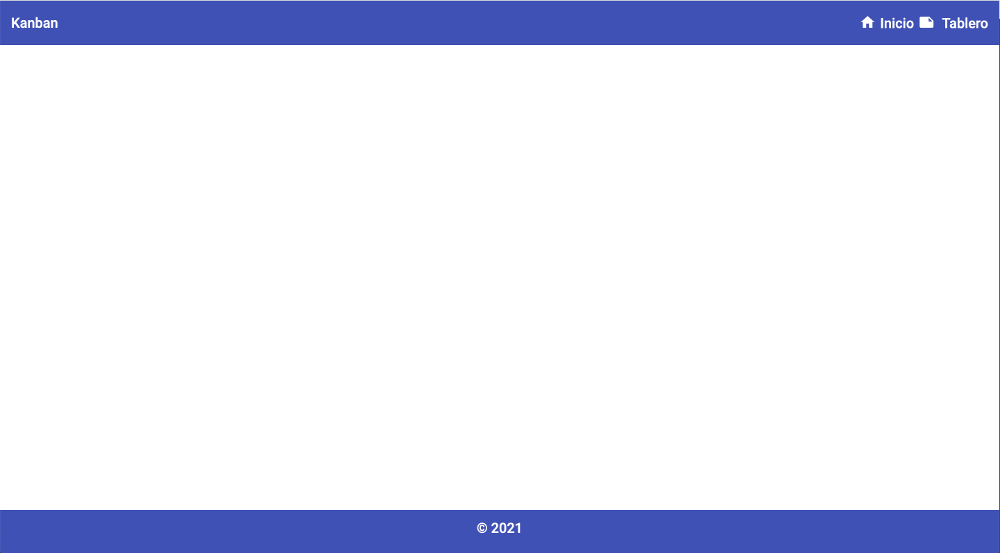

# Creando el Kanban Board

## Prerrequisitos 

Los prerrequisitos serán de un nivel de conocimientos técnicos y de una instalación mínima requerida en tu máquina.  


En conocimientos técnicos es importante que conozcas lo básico de Angular, como son los componentes, directivas, módulos, servicios, routing y formularios.   


### En la instalación mínima requerida, te preguntarás que debo tener instalado? 

Es importante tener instalado [**node.js**](https://nodejs.org/en/) y [**npm**](https://www.npmjs.com/) para que podamos instalar Angular.  


Necesitamos un  Editor de texto o IDE, puede ser [**visual studio code**](https://code.visualstudio.com/)  o el IDE o el editor de texto de tu preferencia.


**Qué es un IDE?** 

Es un entorno de desarrollo integrado o interactivo, que te permite hacer más funcionalidades, puedes instalar extensiones en el para ayudarte a ser más productivo en tu trabajo. Incluso hay extensiones para editar el tema de nuestro entorno de desarrollo.  


Por último necesitamos el [CLI-Angular](https://cli.angular.io/), que nos facilita la creación, generación, ejecución, testing, deploy, en el caso de no tener aún este último instalado, solo necesitas ejecutar en tu terminal, este comando: 

```bash
npm install -g @angular/cli
```

Un Kanban es como un tablero. Sabemos que hemos estado en una situación social de pandemia, que nos ha afectado un poco a nivel productivo, este proyecto te ayudará a organizar un poco tus tareas del día a día, de una forma ágil y efectiva. 

Dirás que este tablero, es parecido a una aplicación de las que encuentras por ahí para descargarla en tu máquina, para qué este proyecto?. Te cuento que con este proyecto podrás ver un poco que tanto tiene esa aplicación que descargas, lo harás tú mismo y podrás personalizarlo de acuerdo a tus necesidades e integrarlo con las herramientas que desees, puedes ir gradualmente aumentandole la complejidad. 

En este tablero podremos ir creando nuestras tareas, tendremos 3 listas, una de tareas:  ¿qué hacer?, otra de tareas en progreso, y una de está hecho, en estas listas iremos colocando las tareas que vayan pasando por cada una de esas etapas.

Tendremos un home, en él podremos ver una lista de nuestras tareas de acuerdo a la prioridad, estas tareas se crearán en la sección tablero donde crearemos nuestras tareas, las podremos mover por nuestras listas y una vez creadas, podemos, en el home revisarlas por categorías.

Usaremos un poco de componentes CDK, así que repasaremos un poco estos conceptos.

## **1. Creando nuestro proyecto**

Una vez instalado el Angular CLI, crearemos un proyecto y añadiremos Angular Material e incluiremos uno de los temas sugeridos, crearemos el módulo donde iremos añadiendo nuestros componentes de Material y CDK.

En nuestro IDE en la terminal ejecutaremos el siguiente comando:

```bash
ng new workshop
```

* Podemos seleccionar que sea estricto.
* Usaremos **SASS**, en este caso escogeremos la sintaxis de sasy.
* Diremos "yes" al routing 
* Una vez termina la creación de nuestro proyecto, podemos ejecutarlo con:

```bash
ng serve -o
```

Es hora de incluir Angular Material y los componentes de CDK, ejecutaremos el siguiente comando:

```bash
ng add @angular/material
```

Seleccionamos un tema:



Configuramos la tipografia global y el browser animation de material.



En nuestro archivo **styles.scss** incluiremos los estilos del tema que acabamos de incluir

```css
@import '@angular/material/prebuilt-themes/indigo-pink.css';
```



Creemos un módulo de material-cdk en el cual iremos importando los módulos de Material y de CDK

```css
ng g m material-cdk
```



## 2. Creando nuestros modulos

Crearemos nuestro módulo shared y core.

```bash
ng g m core
ng g m shared
```

Importamos el **Core Module** y el **Shared Module** en el **App Module**



```typescript
import { CoreModule } from './core/core.module';
import { SharedModule } from './shared/shared.module';

@NgModule({
  declarations: [
    AppComponent
  ],
  imports: [
    ...
    CoreModule,
    SharedModule,
    ...
  ],
  ...
```



  
En nuestro Shared creamos una carpeta components donde incluiremos el componente header y el footer

```bash
ng g c shared/components/header
ng g c shared/components/footer
```

Importamos el módulo de material-cdk en nuestro shared, ya que más adelante incluiremos varios módulos que usaremos en nuestro modulo shared. Ademas crearemos una constante donde pondremos ahi los elementos que vamos a incluir en las declaraciones y en los exports:



```typescript
...
import { MaterialCdkModule } from "./../material-cdk/material-cdk.module";

import { HeaderComponent } from './components/header/header.component';
import { FooterComponent } from './components/footer/footer.component';


const declarables = [ HeaderComponent, FooterComponent ];
@NgModule({
  declarations: [declarables],
  imports: [
    CommonModule,
    MaterialCdkModule,
  ],
  exports: declarables,
})
export class SharedModule { }

```



En el Modulo de Material-CDK incluiremos dos componentes de Material y creamos una constante para colocar los componentes en las declaraciones y exportarlos para ser usados. Importamos el módulo Toolbar y el icon en nuestro módulo material-cdk.




```typescript
//Material
import { MatToolbarModule } from '@angular/material/toolbar';
import { MatIconModule } from '@angular/material/icon';

const components = [MatToolbarModule, MatIconModule];

@NgModule({
  declarations: [],
  imports: [CommonModule, components],
  exports: components,
})
export class MaterialCdkModule {}
```




Coloquemos algo de contenido en nuestro componente Footer y Header.

En nuestro header crearemos un Toolbar, incluiremos algunos iconos para que nuestro toolbar se vea más bonito, si deseas añadir otro icono diferente puedes buscar la lista de iconos en la página de Angular Material.

Nuestro toolbar tendrá un menú, en los anchor añadiremos las rutas que tendremos de los módulos que crearemos en clases posteriores.

Colocaremos un poco de formato, para que nuestra aplicación vaya luciendo mejor.



```markup

<mat-toolbar color="primary" class="toolbar">
  <span>Kanban</span>
  <span class="toolbar__spacer"></span>
  <nav class="toolbar__menu">
    <ul>
      <li>
        <button mat-icon-button class="toolbar__menu__icon favorite-icon" aria-label="Home option">
          <mat-icon>home</mat-icon>
        </button>
        <a href="#" routerLink="/home" routerLinkActive="active" class="toolbar__menu__text">
          <span >Inicio</span>
        </a>
      </li>
      <li>
        <button mat-icon-button class="toolbar__menu__icon" aria-label="Board option">
          <mat-icon>note</mat-icon>
        </button>
        <a href="#" routerLink="/board" routerLinkActive="active" class="toolbar__menu__text"><span>
          Tablero</span>
        </a>
      </li>
    </ul>
  </nav>
</mat-toolbar>
```





```css
.toolbar {
  display: flex;
  &__spacer {
    flex: 1 1 auto;
  }
  &__menu {
    margin: 0 auto;
    list-style:none;
    ul {
      display: flex;
      list-style:none;
    }
    &__icon{
      border:0;
      background-color: transparent;
      color: white;
      vertical-align: middle;
    }
    &__text {
      color: white;
      text-decoration: none;
      vertical-align: middle;
    }
  }
}

```



Coloquemos un atributo en el footer, que será usado en nuestro componente footer



```typescript
today: number = Date.now();
```



En nuestro footer incluiremos otro toolbar, más sencillo y algunos estilos.



```markup
<footer class="footer">
  <mat-toolbar color="primary" class="toolbar">
    <p class="toolbar__text"> &copy; {{ today | date: 'yyyy' }}</p>
  </mat-toolbar>
</footer>
```





```css
.footer {
  bottom: 0;
  position: fixed;
  width: 100%;
  .toolbar {
    &__text {
      text-align: center;
      width: 100%;
    }
  }
}
```



Borremos el contenido de nuestra vista app:  app.component.html y coloquemos un hola!, si observamos en el navegador podemos ver la palabra Hola!



En la vista de app.component.html vamos a incluir nuestro componente header, footer y el router-outlet.



```markup
<app-header></app-header>
<router-outlet></router-outlet>
<app-footer></app-footer>
```





Ahora, crearemos nuestro modulo board con el routing, con el siguiente comando

```bash
ng g m board --routing 
```

 Incluiremos el board módulo en nuestro app.modulo



```typescript
...
import { BoardModule } from './board/board.module';

@NgModule({
  declarations: [
    AppComponent
  ],
  imports: [
  ...
  BoardModule,
  ...
```



Creamos el modulo para el Home

```bash
ng g m home --routing
```

Incluiremos este modulo en app.module



```typescript
import { HomeModule } from './home/home.module';

@NgModule({
  declarations: [
    AppComponent
  ],
  imports: [
  ...
    HomeModule,
  ...
```



Vamos a darle un poco mas de estructura a nuestro modulos para usar el enrutamiento en el Home y el Board.

Creamos un componetente contendor para home y board.

```bash
ng g c board/board
ng g c home/home
```

En el Modulo Board, incluiremos el componente en el enrutamiento.



```typescript
import { BoardComponent } from './board/board.component';

const routes: Routes = [
  {
    path: '',
    component: BoardComponent
  }
];
```



Realizaremos lo mismo para el componente Home.



```typescript
import { HomeComponent } from './home/home.component';

const routes: Routes = [
  {
    path: '',
    component: HomeComponent
  }
];
```



En el app-routing.module incluiremos el enrutamiento para los modulos respectivos, para que al darle clic al link del 'header' redireccione a la sección respectiva.



```typescript
const routes: Routes = [
  {
    path: '',
    redirectTo: '/board',
    pathMatch: 'full',
  },
  {
    path: 'board',
    //loadChildren: './board/board.module#BoardModule'
    loadChildren: () => import('./board/board.module').then(m => m.BoardModule)
  },
  {
    path: 'home',
    //loadChildren: './home/home.module#HomeModule',
    loadChildren: () => import('./home/home.module').then(m => m.HomeModule)
  },
];
```




 

