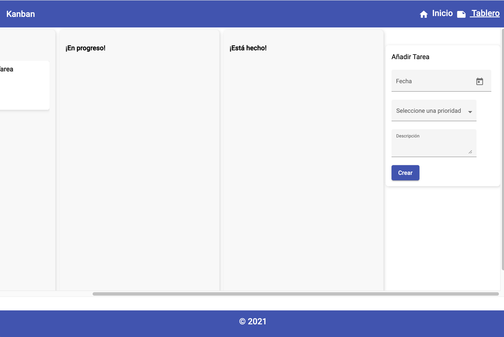
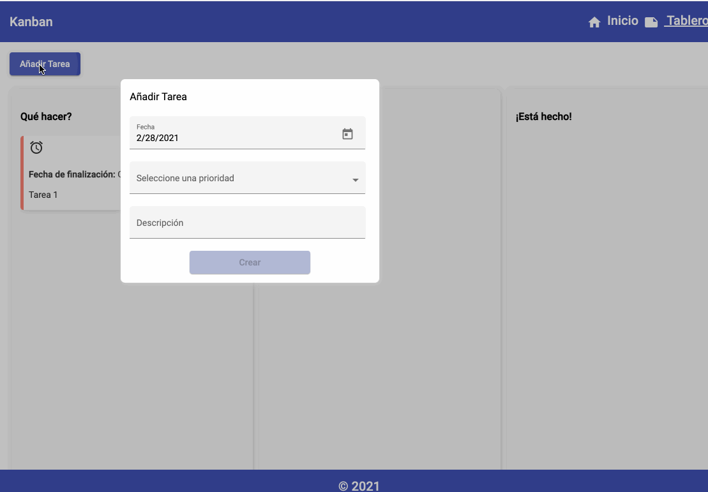
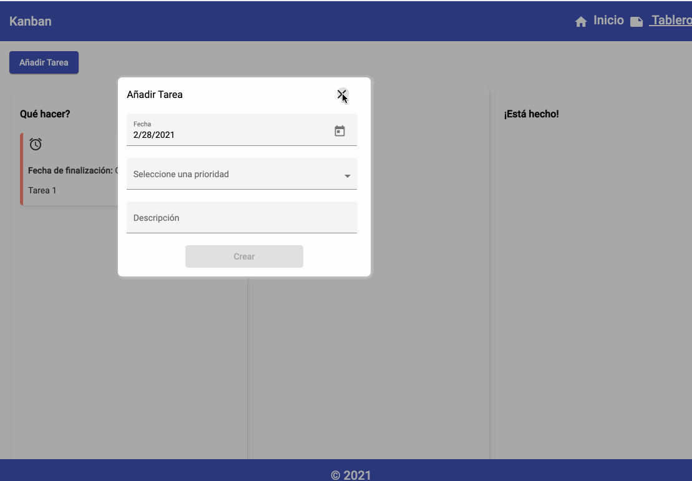
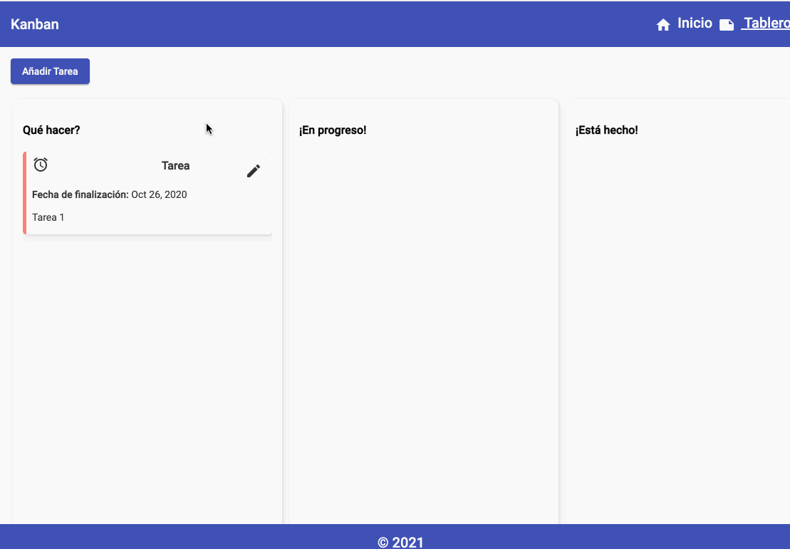
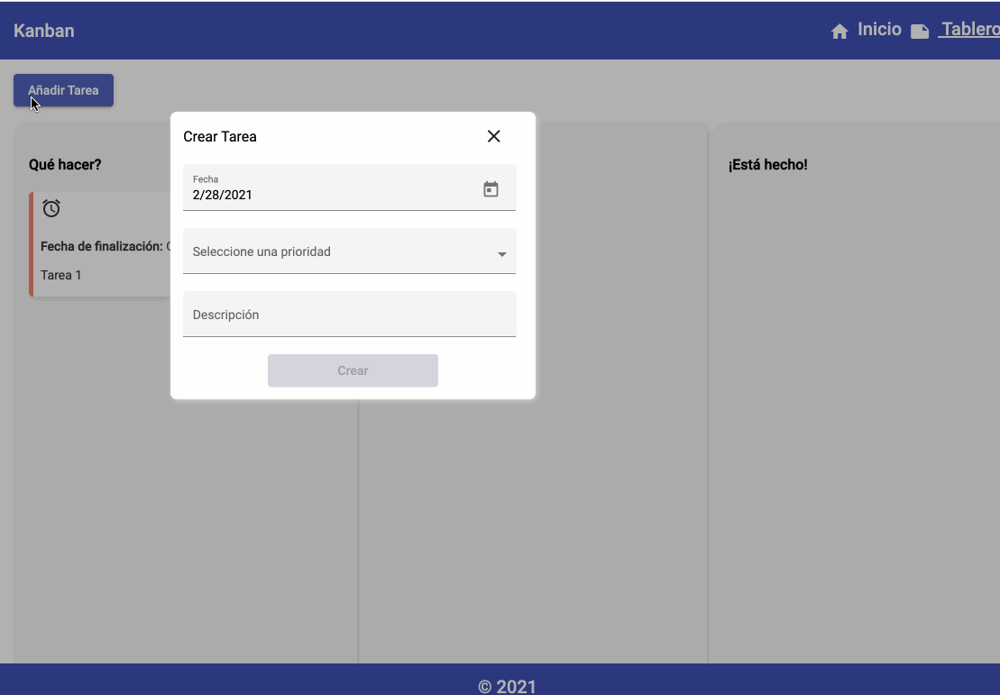

# Creando el Kanban Board

## Prerrequisitos 

Los prerrequisitos serán de un nivel de conocimientos técnicos y de una instalación mínima requerida en tu máquina.  


En conocimientos técnicos es importante que conozcas lo básico de Angular, como son los componentes, directivas, módulos, servicios, routing y formularios.   


### En la instalación mínima requerida, te preguntarás que debo tener instalado? 

Es importante tener instalado [**node.js**](https://nodejs.org/en/) y [**npm**](https://www.npmjs.com/) para que podamos instalar Angular.  


Necesitamos un  Editor de texto o IDE, puede ser [**visual studio code**](https://code.visualstudio.com/)  o el IDE o el editor de texto de tu preferencia.


**Qué es un IDE?** 

Es un entorno de desarrollo integrado o interactivo, que te permite hacer más funcionalidades, puedes instalar extensiones en el para ayudarte a ser más productivo en tu trabajo. Incluso hay extensiones para editar el tema de nuestro entorno de desarrollo.  


Por último necesitamos el [CLI-Angular](https://cli.angular.io/), que nos facilita la creación, generación, ejecución, testing, deploy, en el caso de no tener aún este último instalado, solo necesitas ejecutar en tu terminal, este comando: 

```bash
npm install -g @angular/cli
```

Un Kanban es como un tablero. Sabemos que hemos estado en una situación social de pandemia, que nos ha afectado un poco a nivel productivo, este proyecto te ayudará a organizar un poco tus tareas del día a día, de una forma ágil y efectiva. 

Dirás que este tablero, es parecido a una aplicación de las que encuentras por ahí para descargarla en tu máquina, para qué este proyecto?. Te cuento que con este proyecto podrás ver un poco que tanto tiene esa aplicación que descargas, lo harás tú mismo y podrás personalizarlo de acuerdo a tus necesidades e integrarlo con las herramientas que desees, puedes ir gradualmente aumentandole la complejidad. 

En este tablero podremos ir creando nuestras tareas, tendremos 3 listas, una de tareas:  ¿qué hacer?, otra de tareas en progreso, y una de está hecho, en estas listas iremos colocando las tareas que vayan pasando por cada una de esas etapas.

Tendremos un home, en él podremos ver una lista de nuestras tareas de acuerdo a la prioridad, estas tareas se crearán en la sección tablero donde crearemos nuestras tareas, las podremos mover por nuestras listas y una vez creadas, podemos, en el home revisarlas por categorías.

Usaremos un poco de componentes CDK, así que repasaremos un poco estos conceptos.

## **1. Creando nuestro proyecto**

Una vez instalado el Angular CLI, crearemos un proyecto y añadiremos Angular Material e incluiremos uno de los temas sugeridos, crearemos el módulo donde iremos añadiendo nuestros componentes de Material y CDK.

En nuestro IDE en la terminal ejecutaremos el siguiente comando:

```bash
ng new workshop
```

* Podemos seleccionar que sea estricto.
* Usaremos **SASS**, en este caso escogeremos la sintaxis de sasy.
* Diremos "yes" al routing 
* Una vez termina la creación de nuestro proyecto, podemos ejecutarlo con:

```bash
ng serve -o
```

Es hora de incluir Angular Material y los componentes de CDK, ejecutaremos el siguiente comando:

```bash
ng add @angular/material
```

Seleccionamos un tema:


Configuramos la tipografia global y el browser animation de material.


En nuestro archivo **styles.scss** incluiremos los estilos del tema que acabamos de incluir

```css
@import '@angular/material/prebuilt-themes/indigo-pink.css';
```


Creemos un módulo de material-cdk en el cual iremos importando los módulos de Material y de CDK

```css
ng g m material-cdk
```


## 2. Creando nuestros modulos

Crearemos nuestro módulo shared y core.

```bash
ng g m core
ng g m shared
```

Importamos el **Core Module** y el **Shared Module** en el **App Module**



```typescript
import { CoreModule } from './core/core.module';
import { SharedModule } from './shared/shared.module';

@NgModule({
  declarations: [
    AppComponent
  ],
  imports: [
    ...
    CoreModule,
    SharedModule,
    ...
  ],
  ...
```



  
En nuestro Shared creamos una carpeta components donde incluiremos el componente header y el footer

```bash
ng g c shared/components/header
ng g c shared/components/footer
```

Importamos el módulo de material-cdk en nuestro shared, ya que más adelante incluiremos varios módulos que usaremos en nuestro modulo shared. Ademas crearemos una constante donde pondremos ahi los elementos que vamos a incluir en las declaraciones y en los exports:



```typescript
...
import { MaterialCdkModule } from "./../material-cdk/material-cdk.module";

import { HeaderComponent } from './components/header/header.component';
import { FooterComponent } from './components/footer/footer.component';


const declarables = [ HeaderComponent, FooterComponent ];
@NgModule({
  declarations: [declarables],
  imports: [
    CommonModule,
    MaterialCdkModule,
  ],
  exports: declarables,
})
export class SharedModule { }

```



En el Modulo de Material-CDK incluiremos dos componentes de Material y creamos una constante para colocar los componentes en las declaraciones y exportarlos para ser usados. Importamos el módulo Toolbar y el icon en nuestro módulo material-cdk.




```typescript
//Material
import { MatToolbarModule } from '@angular/material/toolbar';
import { MatIconModule } from '@angular/material/icon';

const components = [MatToolbarModule, MatIconModule];

@NgModule({
  declarations: [],
  imports: [CommonModule, components],
  exports: components,
})
export class MaterialCdkModule {}
```




Coloquemos algo de contenido en nuestro componente Footer y Header.

En nuestro header crearemos un Toolbar, incluiremos algunos iconos para que nuestro toolbar se vea más bonito, si deseas añadir otro icono diferente puedes buscar la lista de iconos en la página de Angular Material.

Nuestro toolbar tendrá un menú, en los anchor añadiremos las rutas que tendremos de los módulos que crearemos en clases posteriores.

Colocaremos un poco de formato, para que nuestra aplicación vaya luciendo mejor.



```markup

<mat-toolbar color="primary" class="toolbar">
  <span>Kanban</span>
  <span class="toolbar__spacer"></span>
  <nav class="toolbar__menu">
    <ul>
      <li>
        <button mat-icon-button class="toolbar__menu__icon favorite-icon" aria-label="Home option">
          <mat-icon>home</mat-icon>
        </button>
        <a href="#" routerLink="/home" routerLinkActive="active" class="toolbar__menu__text">
          <span >Inicio</span>
        </a>
      </li>
      <li>
        <button mat-icon-button class="toolbar__menu__icon" aria-label="Board option">
          <mat-icon>note</mat-icon>
        </button>
        <a href="#" routerLink="/board" routerLinkActive="active" class="toolbar__menu__text"><span>
          Tablero</span>
        </a>
      </li>
    </ul>
  </nav>
</mat-toolbar>
```





```css
.toolbar {
  display: flex;
  &__spacer {
    flex: 1 1 auto;
  }
  &__menu {
    margin: 0 auto;
    list-style:none;
    ul {
      display: flex;
      list-style:none;
    }
    &__icon{
      border:0;
      background-color: transparent;
      color: white;
      vertical-align: middle;
    }
    &__text {
      color: white;
      text-decoration: none;
      vertical-align: middle;
    }
  }
}

```



Coloquemos un atributo en el footer, que será usado en nuestro componente footer



```typescript
today: number = Date.now();
```



En nuestro footer incluiremos otro toolbar, más sencillo y algunos estilos.



```markup
<footer class="footer">
  <mat-toolbar color="primary" class="toolbar">
    <p class="toolbar__text"> &copy; {{ today | date: 'yyyy' }}</p>
  </mat-toolbar>
</footer>
```





```css
.footer {
  bottom: 0;
  position: fixed;
  width: 100%;
  .toolbar {
    &__text {
      text-align: center;
      width: 100%;
    }
  }
}
```



Borremos el contenido de nuestra vista app:  app.component.html y coloquemos un hola!, si observamos en el navegador podemos ver la palabra Hola!


En la vista de app.component.html vamos a incluir nuestro componente header, footer y el router-outlet.



```markup
<app-header></app-header>
<router-outlet></router-outlet>
<app-footer></app-footer>
```




Ahora, crearemos nuestro modulo board con el routing, con el siguiente comando

```bash
ng g m board --routing 
```

 Incluiremos el board módulo en nuestro app.modulo



```typescript
...
import { BoardModule } from './board/board.module';

@NgModule({
  declarations: [
    AppComponent
  ],
  imports: [
  ...
  BoardModule,
  ...
```



Creamos el modulo para el Home

```bash
ng g m home --routing
```

Incluiremos este modulo en app.module



```typescript
import { HomeModule } from './home/home.module';

@NgModule({
  declarations: [
    AppComponent
  ],
  imports: [
  ...
    HomeModule,
  ...
```



Vamos a darle un poco mas de estructura a nuestro modulos para usar el enrutamiento en el Home y el Board.

Creamos un componetente contendor para home y board.

```bash
ng g c board/board
ng g c home/home
```

En el Modulo Board, incluiremos el componente en el enrutamiento.



```typescript
import { BoardComponent } from './board/board.component';

const routes: Routes = [
  {
    path: '',
    component: BoardComponent
  }
];
```



Realizaremos lo mismo para el componente Home.



```typescript
import { HomeComponent } from './home/home.component';

const routes: Routes = [
  {
    path: '',
    component: HomeComponent
  }
];
```



En el app-routing.module incluiremos el enrutamiento para los modulos respectivos, para que al darle clic al link del 'header' redireccione a la sección respectiva.



```typescript
const routes: Routes = [
  {
    path: '',
    redirectTo: '/board',
    pathMatch: 'full',
  },
  {
    path: 'board',
    //loadChildren: './board/board.module#BoardModule'
    loadChildren: () => import('./board/board.module').then(m => m.BoardModule)
  },
  {
    path: 'home',
    //loadChildren: './home/home.module#HomeModule',
    loadChildren: () => import('./home/home.module').then(m => m.HomeModule)
  },
];
```



Al dar clic sobre los links del header aún no pasa la redirección, es porque en el "Shared" modulo debemos agregar el "RouterModule", para que funcionen las directivas en el header.



```typescript
import { RouterModule } from '@angular/router';

@NgModule({
  declarations: [declarables],
  imports: [
    CommonModule,
    RouterModule,
    MaterialCdkModule,
  ],
  exports: declarables,
})
export class SharedModule { }
```



Al haver clic en cada link, ahora si ocurre la redirección. Al crear nuestro header  colocamos el icnono fuera de los anchore, vamos a inclurilos en el anchore y a colocar un pequeño estilo para el link activo.



```css
...
&__text {
  color: white;
  text-decoration: none;
  vertical-align: middle;
  &.active {
    text-decoration: underline ;
  }
}
...
```



Nuestra página se verá así:


## 3. Creando Componentes

Nuestro Board tiene tres columnas, que es donde se mostraran las tareas respectivas, necesitamos un componente de presentacion para la lista y otro para las tareas.

Primero crearemos nuestro componente lista, en una carpeta de componentes dentro de nuestro Board Module 

```bash
ng g c board/components/list
```

Incluimos nuestro componente list en el contanedor del board.



```markup
<main class="board">
  <app-list></app-list>
</main>
```



Como mencionamos el componente list tendrá tareas, entonces crearemos nuestro componente tarea.

```bash
ng g c board/components/task
```

Añadimos en nuestro componente list el componente tarea



```markup
<div
	class="list"
>
	<h3 class="list__title"><strong>Titulo</strong></h3>
	<div class="list__tasks">
		<app-task></app-task>
	</div>
</div>
```



Pondremos un poco de estilo a nuestra lista



```css
.list {
  background-color: #f5f5f5ad;
  border-radius: 10px;
  box-shadow: 0.1em 0.1em 0.5em lightgrey;
  height: 80vh;
  margin: 5px;
  padding: 1em;
  width: 350px;
    
  &__title {
    margin: 0;
    padding: 16px 0;
  }
  
  &__tasks {
    height: 60vh;
    overflow-y: auto;
  }
}
```




En nuestra aplicación usaremos data mockeada, entonces crearemos un servicio mock y lo incluiremos en nuestro contenedor para pasar la data a los componentes de presentación.

Para la data mockeada podemos crear un json o crear un API mock en [mocky.io](https://designer.mocky.io/) para luego consumirla en tu servicio.

Creamos un servicio en el Core module.

```bash
ng g s core/services/api
```

Creamos un index para exportar los servicios que crearemos en el core.

```bash
export * from './api.service';
```

Incluimos nuestra API en el Core Module



```typescript
import { ApiService } from './services';

@NgModule({
  declarations: [],
  imports: [
    CommonModule
  ],
  providers: [
    ApiService
  ]
})
export class CoreModule { }
```



Incluimos el '**HttpClientModule**' en el archivo **app.module.ts**




```typescript
import { HttpClientModule } from '@angular/common/http';

@NgModule({
  declarations: [
    AppComponent
  ],
  imports: [
    BrowserModule,
    AppRoutingModule,
    BrowserAnimationsModule,
    HttpClientModule,
    ...
```




En los imports incluimos el **HttpClientModule** en el '**app.module.ts'**

 Importamos unas dependencias en nuestro nuevo archivo llamado **api.service.ts**,  y añadimos en el constructor lo siguiente: **http: HttpClient** , haciendo uso de la inyección de dependencias \(Patron de diseño\). Este http, va a ser uso de lo que tenga el HttpClient, que este hace parte del nuevo modulo que incluimos en el app.module.ts

Tambien crearemos dos funciones una para obtener la url del API y otra para el manejo de errores, haciendo uso de **HttpErrorResponse.**

Para la url del api, he creado 3, para jugar con los diferentes mocks.

```typescript
 //api with one task
 private apiRoot: string = 'https://run.mocky.io/v3/26045374-863c-469d-85c4-51ea1135ce8a';
 
 //api without any task
 private apiRoot: string = 'https://run.mocky.io/v3/7841d1af-e8d5-446a-bac5-3506fdd05659';
 
 // api with many task
 private apiRoot: string = 'https://run.mocky.io/v3/0933ddef-c9bf-4f26-8ddf-77990fb490cb';
```

Incluso cree un archivo json con alguna data mockeada.



```javascript
{
  "list": [
    {
      "id": "1",
      "name": "Qué hacer?",
      "tasks": [
        {
          "id": "1",
          "description": "Tarea 1",
          "date": "10/26/20",
          "priority": "urgent"
        }
      ]
    },
    {
      "id": "2",
      "name": "¡En progreso!",
      "tasks": []
    },
    {
      "id": "3",
      "name": "¡Está hecho!",
      "tasks": []
    }
  ]
}

```



Este seria el contenido para nuestro servicio

```typescript
import { HttpClient, HttpErrorResponse } from '@angular/common/http';
import { throwError as observableThrowError } from 'rxjs';
import { catchError, map } from 'rxjs/operators';

@Injectable({
  providedIn: 'root'
})
export class ApiService {
  
  private apiRoot: string = 'https://run.mocky.io/v3/7015be8f-9657-4eda-af57-ca508c855e66';
  
  constructor(private http: HttpClient) { }

 /* Get Api Data from mock service */
  getApi() {
    return this.http
      .get<Array<{}>>(this.apiRoot)
      .pipe(map(data => data), catchError(this.handleError));
  }

  /* Handle request error */
  private handleError(res: HttpErrorResponse){
    return observableThrowError(res.error || 'Server error');
  }
}
```

Creare dos interfaces para las tareas y la lista, en una carpeta llamada models. Ademas de incluir un indice en esa carpeta.



```typescript
export interface TaskSchema {
  id: string;
  description: string;
  date: string;
  priority: string;
}
```





```typescript
import { TaskSchema } from './index';

export interface ListSchema {
    id: string;
    name: string;
    cards: TaskSchema[];
}
```





```typescript
export * from './taskschema';
export * from './listschema';
```



Haremos uso de nuestro servicio en nuestro contenedor board.



```typescript
import { Component, OnInit } from '@angular/core';
import { ApiService, ListSchema } from './../../core';
@Component({
  selector: 'app-board',
  templateUrl: './board.component.html',
  styleUrls: ['./board.component.scss'],
})
export class BoardComponent implements OnInit {
  lists: ListSchema[];

  constructor(private apiService: ApiService) {
    this.lists = [];
  }

  ngOnInit(): void {
    this.getDataList();
  }

  getDataList(): void {
    this.apiService.getApi().subscribe(
      (response: any) => this.lists = response['list'],
      error => console.log('Ups! we have an error: ', error)
    );
  }
}

```



Pasamos la data a nuestro componente list.



```markup
<main class="board">
  <app-list 
  *ngFor="let list of lists"
  [list]="list"
></app-list>
</main>
```



Añadamos algo de estilos en el board.



```css
.board {
  display: flex;
  height: 80vh;
  overflow-x: auto;
  padding: 0 1em;
}
```



Mostraremos la data que recibimos en el componente list.



```typescript
...
import { ListSchema } from "./../../../core";

@Component({
  selector: 'app-list',
  templateUrl: './list.component.html',
  styleUrls: ['./list.component.scss']
})
export class ListComponent implements OnInit {
  @Input() list: ListSchema;

  constructor() {
   }
   ...
```





```markup
<div
	class="list"
	id="list_{{list.id}}"
>
	<h3 class="list__title"><strong>{{list.name}}</strong></h3>
	<div class="list__tasks">
		<app-task *ngFor="let task of list.tasks" [task]="task"></app-task>
	</div>
</div>
```



Editaremos el componente 'task' para recibir la data del componente list

```typescript
import { TaskSchema } from "./../../../core";

export class TaskComponent implements OnInit {
  @Input() task: TaskSchema;
  ...
```



```typescript
<div 
  class="task"
  id="task_{{task.id}}"
  [ngClass]="{'task--urgent': task.priority === 'urgent', 'task--moderate': task.priority === 'moderate', 'task--low': task.priority === 'low'}"
  >
  <div class="task__icon">
    <mat-icon aria-hidden="false" aria-label="urgent icon" *ngIf="task.priority === 'urgent'">alarm</mat-icon>
    <mat-icon aria-hidden="false" aria-label="medium icon" *ngIf="task.priority === 'moderate'">autorenew</mat-icon>
    <mat-icon aria-hidden="false" aria-label="medium icon" *ngIf="task.priority === 'low'">assignment_returned</mat-icon>
  </div>
  <h3 class="task__title">Tarea</h3>
  <p class="task__date"><strong>Fecha de finalización:</strong> {{ task.date | date }}</p>
  <p class="task__description">{{task.description}}</p>
</div>
```



Así se ve nuestra app hasta ahora


Si jugamos con los diferentes mocks, vamos a ver como podemos tener mas tareas.

### Componente Drag&Drop

Vamos a añadir el componente del Drag&Drop del CDK para mover las tareas, en las diferentes listas. Incluimos el componente en el material-cdk.module.ts



```typescript
//CDK
import { DragDropModule } from '@angular/cdk/drag-drop';

const components = [MatToolbarModule, MatIconModule, DragDropModule];
...
```



Devemos importar el Modulo de matrial-cdk en el modulo Board



```typescript
...
import { MaterialCdkModule } from './../material-cdk/material-cdk.module';
...
@NgModule({
  ...  
  imports: [
    ...
    MaterialCdkModule..
    .
```



Usaremos ciertas directivas del Drag&Drop y funciones.



```markup
<main class="board" cdkDropListGroup>
  ...
</main>

```





```markup
<div
	class="list"
	id="list_{{list.id}}"
	cdkDropList
	[cdkDropListData]="list.tasks"
	(cdkDropListDropped)="drop($event)"
>
	...
	<div class="list__tasks">
		<app-task *ngFor="let task of list.tasks" [task]="task" cdkDrag></app-task>
	</div>
</div>
```





```typescript
import { CdkDragDrop, moveItemInArray, transferArrayItem } from '@angular/cdk/drag-drop';
...
@Component({
  selector: 'app-list',
  templateUrl: './list.component.html',
  styleUrls: ['./list.component.scss'],
})
export class ListComponent implements OnInit {
...
  drop(event: CdkDragDrop<string[]>) {
    if (event.previousContainer === event.container) {
      moveItemInArray(event.container.data, event.previousIndex, event.currentIndex);
    } else {
      transferArrayItem(event.previousContainer.data,
                        event.container.data,
                        event.previousIndex,
                        event.currentIndex);
    }
  }
...
```



En nuestra página podremos arrastrar nuestra tarea.


### Crear Tarea

De tener más tareas en cada lista, podriamos moverlas por los diferentes estados en los que tendríamos nuestras tareas, ahora creemos un componente que nos permita crear las tareas. Con el angular-cli creemos nuestro componente.

```bash
ng g c board/components/create-task
```

Crearemos un formulario reactivo, para ello necesitamos incluir en el board.module.ts el modelo de formulario.



```typescript
import { FormsModule, ReactiveFormsModule } from '@angular/forms';

...

@NgModule({
  ...
  imports: [
  ...
  FormsModule,
  ReactiveFormsModule,
  ...
```



Usaremos en el formulario varios componentes de material, asi que importaremos los elementos necesarios en material-cdk.ts



```typescript
...
//Material
import { MatToolbarModule } from '@angular/material/toolbar';
import { MatIconModule } from '@angular/material/icon';
import { MatButtonModule } from '@angular/material/button';
import { MatFormFieldModule } from '@angular/material/form-field';
import { MatInputModule } from '@angular/material/input';
import { MatSelectModule } from '@angular/material/select';
import { MatDatepickerModule } from '@angular/material/datepicker';
import { MatNativeDateModule } from '@angular/material/core';

...

const components = [
  MatToolbarModule,
  MatIconModule,
  MatButtonModule,
  MatFormFieldModule,
  MatInputModule,
  MatSelectModule,
  MatDatepickerModule,
  MatNativeDateModule,
  DragDropModule,
];
...
```



En el componente de create-task, vamos a crear el modelo del formulario.



```typescript
import { Component, OnInit } from '@angular/core';
import { FormBuilder, FormGroup, Validators } from '@angular/forms';

@Component({
  selector: 'app-create-task',
  templateUrl: './create-task.component.html',
  styleUrls: ['./create-task.component.scss']
})
export class CreateTaskComponent implements OnInit {
  createTask: FormGroup;

  constructor(private fb: FormBuilder) { }

  ngOnInit(): void {
    this.setForm();
  }
  
  setForm(): void {
    this.createTask = this.fb.group({
      date : [''],
      priority: [''],
      description : [ '' ]
    });
  }

  onFormAdd(form: any): void {

  }


}


```



Añadimos las etiquetas respectivas en nuestro componente create-task, para darle forma a nuestro formulario.



```markup
<form class="form" novalidate> 
  <header>
      <h3>Añadir Tarea</h3>
  </header>
  <section> 
    <mat-form-field class="form__fields__item" appearance="fill">
      <mat-label>Fecha</mat-label>
      <input matInput placeholder="Fecha" formControlName="date" [matDatepicker]="picker">
      <mat-datepicker-toggle matSuffix [for]="picker"></mat-datepicker-toggle>
      <mat-datepicker #picker></mat-datepicker>
    </mat-form-field>

    <mat-form-field appearance="fill">
      <mat-label>Seleccione una prioridad</mat-label>
      <select matNativeControl name="priority" formControlName="priority">
        <option value="" selected></option>
      </select>
    </mat-form-field>

    <mat-form-field appearance="fill" color="primary">
      <mat-label>Descripción</mat-label>
      <textarea
        matInput
        formControlName="description"
        >
      </textarea>
    </mat-form-field>
    
    <button mat-raised-button color="primary">Crear</button>
  </section>
</form> 
```



Podremos un poco de estilos



```css
.form {
  background-color: white;
  border-radius: .5em;
  box-shadow: none;
  margin: 3em auto 0;
  padding: 1em;

  &__fields {
    display: flex;
    flex-direction: column;
    flex-wrap: wrap;
    justify-content: space-between;
    
    &__item {
      flex: 1;
      padding-right: .5em;

      .mat-icon {
        padding-right: .5em;
        vertical-align: bottom;
      }
    }
  }

  &__header {
    display: flex;
    flex-direction: column;
    justify-content: space-between; 
    &__title {
      text-align: center;
    }
    &__close-button {
      border: 0;
      box-shadow: none;
      position: relative;
      top: -10px;
    }
  }

  @media (min-width: 960px) {
    box-shadow: .1em .1em .5em lightgrey;
    width: 50%;
    &__fields {
      align-items: center;
      flex-direction: row;
      &__item {
        flex: 1 40%;
      }
      &__button {
        margin: 0 auto;
        width: 50%;
      }
    }

    &__header {
      flex-direction: row;
      &__button {
        min-width: 20%;
      }
      h1 {
        text-align: left;
      }
    }
  }
}
```



Si colocamos nuestro nuevo componente en el board.component, tal vez nuestra aplicación no se verá muy linda.



```markup
...
<app-create-task></app-create-task>
...
```





Mientras ubicamos el formulario en el lugar correspondiente, crearemos una tributo que guardará la prioridad seleccionado de nuestro dropdown y otro para los valores que mostrará el dropdown.



```typescript
import { FormBuilder, FormGroup, Validators } from '@angular/forms';

type DropdownObject = {
  value: string;
  viewValue: string;
};

export class CreateTaskComponent implements OnInit {
  createTask: FormGroup;
  selectedPriority: string;
  
  priorities: DropdownObject[] = [
    { value: 'urgent', viewValue: 'Urgente' },
    { value: 'moderate', viewValue: 'Moderado' },
    { value: 'low', viewValue: 'Bajo' },
  ];
  
  ...
  
  ngOnInit(): void {
    this.setForm();
    this.selectedPriority = '';
  }

  setForm(): void {
    this.createTask = this.fb.group({
      date: [new Date(), Validators.required],
      priority: ['urgent', Validators.required],
      description: ['', Validators.required],
    });
  }

  onFormAdd(form: TaskSchema): void {
    if (this.createTask.valid) {
      console.log('valid');
    }
  }
```



En el html del create-task pondremos los binding, atributos y las directivas necesarias para que nuestro formulario funcione.



```markup
<form class="form" [formGroup]="createTask"  (ngSubmit)="onFormAdd(createTask.value)" novalidate> 
  <header class="form__header">
      <h3 class="form__header__title">Añadir Tarea</h3>
  </header>
  <section class="form__fields"> 
    <mat-form-field class="form__fields__item" appearance="fill">
      <mat-label>Fecha</mat-label>
      <input matInput placeholder="Fecha" formControlName="date" [matDatepicker]="picker">
      <mat-datepicker-toggle matSuffix [for]="picker"></mat-datepicker-toggle>
      <mat-datepicker #picker></mat-datepicker>
      <mat-error>
        Fecha es <strong>requerida</strong>
      </mat-error>
    </mat-form-field>

    <mat-form-field class="form__fields__item" appearance="fill">
      <mat-label>Seleccione una prioridad</mat-label>
      <select matNativeControl [(ngModel)]="selectedPriority"  name="priority" formControlName="priority">
        <option value="" selected></option>
        <option *ngFor="let priority of priorities" [value]="priority.value">
          {{priority.viewValue}}
        </option>
      </select>
      <mat-error>
        Prioridad es <strong>requerida</strong>
      </mat-error>
    </mat-form-field>

    <mat-form-field class="form__fields__item" appearance="fill" color="primary">
      <mat-label>Descripción</mat-label>
      <textarea
        matInput
        formControlName="description"
      >
      </textarea>
      <mat-error>
        Descripcion es <strong>requerida</strong>
      </mat-error>
    </mat-form-field>
    
    <button class="form__fields__button" mat-raised-button color="primary" [disabled]="!createTask.valid">Crear</button>
  </section>
</form> 
```



La idea es que al presionar un boton para crear la tarea podamos en un overlay ver nuestro formulario, para hacer uso del Overlay, vamos a importar en material-cdk el elemento, ademas de importar un componente que usaremos en el formulario de creación para que Textarea de nuestro formulario tengo un crecimiento dinámico.



```typescript
import { OverlayModule } from '@angular/cdk/overlay';
import { TextFieldModule } from '@angular/cdk/text-field';


const components = [
  ...
  DragDropModule,
  OverlayModule,
  TextFieldModule
];
```



Añadamos las directivas y atributos necesarios en nuestro componente de Textarea



```markup
<textarea
matInput
formControlName="description"
cdkTextareaAutosize
#autosize="cdkTextareaAutosize"
cdkAutosizeMinRows="1"
cdkAutosizeMaxRows="5"
>
```



En el componente incluiremos unas dependencias que necesitamos para este comportamiento del CDK en el texarea.



```typescript
import { Component, NgZone, OnInit, ViewChild } from '@angular/core';
...
import { CdkTextareaAutosize } from '@angular/cdk/text-field';
import { take } from 'rxjs/operators';

...

@Component({
  selector: 'app-create-task',
  templateUrl: './create-task.component.html',
  styleUrls: ['./create-task.component.scss'],
})
export class CreateTaskComponent implements OnInit {
  @ViewChild('autosize') autosize: CdkTextareaAutosize;
  ...
  constructor(private fb: FormBuilder, private _ngZone: NgZone) {}
  ...
  triggerResize() {
    // Wait for changes to be applied, then trigger textarea resize.
    this._ngZone.onStable
      .pipe(take(1))
      .subscribe(() => this.autosize.resizeToFitContent(true));
  }
```



Para el overlay vamos a importar el CdkConnectedOverlay, el cual usaremos en las opciones que crearemos para darle una configuración minima a nuestro overlay. Esta lógica la pondremos en el board component.



```typescript

  import { CdkConnectedOverlay } from '@angular/cdk/overlay';
  
  ...
  
  isOverlayDisplayed = false;
  readonly overlayOptions: Partial<CdkConnectedOverlay> = {
    hasBackdrop: true,
    positions: [
      { originX: 'start', originY: 'top', overlayX: 'start',  overlayY: 'top'}
    ]
  };
  
...
displayOverlay(): void {
  this.isOverlayDisplayed = true;
}

hideOverlay(): void {
  this.isOverlayDisplayed = false;
}
...
```



En el board.component.html incluiremos un template para mostrar el overlay.



```markup
<main class="board" cdkDropListGroup>
  <button
    class="board__add"
    cdkOverlayOrigin
    (click)="displayOverlay()"
    #trigger="cdkOverlayOrigin"
    mat-raised-button
    color="primary"
  >
    Añadir Tarea
  </button>
  <section class="board__list">
    <app-list *ngFor="let list of lists" [list]="list"></app-list>
  </section>
  <ng-template
    #connectedOverlay="cdkConnectedOverlay"
    cdkConnectedOverlay
    [cdkConnectedOverlayOrigin]="trigger"
    [cdkConnectedOverlayOpen]="isOverlayDisplayed"
    [cdkConnectedOverlayHasBackdrop]="overlayOptions.hasBackdrop"
    [cdkConnectedOverlayPositions]="overlayOptions.positions"
    (backdropClick)="hideOverlay()"
    (detach)="hideOverlay()"
  >
    <app-create-task [connectedOverlay]="connectedOverlay"></app-create-task>
  </ng-template>
</main>

```



Reestructuraremos un poco los estilos del componente board.



```css
.board {
  &__add {
    margin: 1rem;
  }
  &__list {
    display: flex;
    height: 80vh;
    overflow-x: auto;
    padding: 0 1em;
  }
}
```





Al presionar el botón de crear, podemos llamar a nuestro overlay, pero no podemos cerrar en el caso de que no deseemos seguir con este proceso, para ello necesitamos añadir en nuestro componente de creación un boton para cerrar nuestro overlay.



```typescript
import { Component, Input, NgZone, OnInit, ViewChild } from '@angular/core';
...
import { CdkConnectedOverlay } from '@angular/cdk/overlay';

...
@Input() connectedOverlay: CdkConnectedOverlay;

...
  close(): void {
    this.connectedOverlay.overlayRef.detach();
  }
```



Incluiremos el botón en nuestro html del create-task



```markup
...
<button class="form__header__close-button" mat-raised-button (click)="close()">
    <mat-icon aria-hidden="false" aria-label="close icon">close</mat-icon>
</button>
...
```



Revisando en nuestra aplicación cuando llamemos al overlay, podemos ver en el formulario un icono que al ser presionado, nos permitirá cerrar nuestro overlay.



### Editar Tarea

Hemos creado la funcionalidad para crear tareas, ahora crearemos la funcionalidad para editar una tarea.

En el componente tarea, crearemos un icono que al ser presionado nos permitirá editar nuestra tarea.



```markup
<button  matTooltip="Editar tarea" matTooltipClass="custom-tooltip-blue" matTooltipPosition="above" mat-icon-button (click)="handleEditTask(task)">
  <mat-icon aria-label="icon-button to edit">edit</mat-icon>
</button>
```





```typescript
import { Component, EventEmitter, Input, OnInit, Output } from '@angular/core';

...
@Output() editTask: EventEmitter<TaskSchema> = new EventEmitter();
...
handleEditTask(task: TaskSchema){
    this.editTask.emit(task);
}
```



Queremos que al presionar el icono podamos editar nuestra tarea emitiendo el evento al padre, y queremos llamar al overlay mostrando la información de la tarea seleccionada. Ya emitimos la data desde el hijo tarea, ahora necesitamos desde el hijo lista, emitirla al padre, para que este pase la data al componente de crear.



```markup
<div class="list__tasks">
    <app-task *ngFor="let task of list.tasks" [task]="task" (editTask)="handleEdit(task)" cdkDrag></app-task>
</div>
```





```typescript
import { Component, EventEmitter, Input, OnInit, Output } from '@angular/core';
...
@Output() editTask: EventEmitter<TaskSchema> = new EventEmitter();
...
handleEdit(task: TaskSchema){
    this.editTask.emit(task);
}
```



En el padre en el componente board, vamos  crear un atributo task que será el que pasaremos al create-task y el cual editaremos dentro de la funcion que muestra el overlay.



```markup
<main class="board" cdkDropListGroup>
  <button
    class="board__add"
    cdkOverlayOrigin
    (click)="displayOverlay()"
    #trigger="cdkOverlayOrigin"
    mat-raised-button
    color="primary"
  >
    Añadir Tarea
  </button>
  <section class="board__list">
    <app-list *ngFor="let list of lists" [list]="list" (editTask)="displayOverlay($event)"></app-list>
  </section>
  <ng-template
    #connectedOverlay="cdkConnectedOverlay"
    cdkConnectedOverlay
    [cdkConnectedOverlayOrigin]="trigger"
    [cdkConnectedOverlayOpen]="isOverlayDisplayed"
    [cdkConnectedOverlayHasBackdrop]="overlayOptions.hasBackdrop"
    [cdkConnectedOverlayPositions]="overlayOptions.positions"
    (backdropClick)="hideOverlay()"
    (detach)="hideOverlay()"
  >
    <app-create-task [connectedOverlay]="connectedOverlay" [task]="task"></app-create-task>
  </ng-template>
</main>

```





```typescript
import { ApiService, ListSchema, TaskSchema } from './../../core';
...
const initialValue = {
  id: '',
  description: '',
  date: '',
  priority: '',
};
...
task: TaskSchema;
...
constructor(private apiService: ApiService) {
  this.task = initialValue;
}
...
displayOverlay(event?: any): void {
  this.isOverlayDisplayed = true;
  if (!!event) {
    this.task = {
      date: event.date,
      id: event.id,
      description: event.description,
      priority: event.priority,
    };
  } else {
    this.task = initialValue;
  }
}
```



En el componente create-task vamos a editar el componente para recibir la informacion de la tarea, ademas crearemos un atributo que manera el texto del titulo y del boton, dependiendo si se esta editando o creando.



```typescript
 ... 
  @Input() task?: TaskSchema;
  formText: string;
  ...
  ngOnInit(): void {
    this.setForm();
    this.selectedPriority = '';
    if (this.task && this.task.id.length > 0) {
      this.setValuesOnForm(this.task);
      this.formText = 'Editar';
      this.selectedPriority = this.task.priority;
    } else {
      this.formText = 'Crear';
    }
  }
  ...
  onFormAdd(form: TaskSchema): void {
    if (this.createTask.valid) {
      console.log('valid');
      this.close();
    } else {
      console.log('editada');
      this.close();
    }
  }

  setValuesOnForm(form: TaskSchema): void {
    this.createTask.setValue({
      date: new Date(form.date),
      priority: form.priority,
      description: form.description 
   });
  }
  ...
```



En la vista del create-task vamos a colocar el atributo que manejara el texto del titulo y del botón



```markup
...
<h3 class="form__header__title">{{ formText }} Tarea</h3>
...
<button
    class="form__fields__button"
    mat-raised-button
    color="primary"
    [disabled]="!createTask.valid"
>
{{formText}}
</button>
```





### Eliminar Tarea

En la vista del componente tarea vamos a añadir otro botón para que se encargue de la funcionalidad de eliminar.



```markup
 <button  matTooltip="Eliminar tarea" matTooltipPosition="above" mat-icon-button (click)="removeTask(task.id)">
   <mat-icon aria-label="icon-button to remove">delete</mat-icon>
 </button>
```



En nuestro task.component.ts crearemos la función que eliminará la tarea.



```typescript
  removeTask(taskId: string): void {
    console.log('Eliminar tarea', taskId);
  }
```



Para hacer más visible al usuario que hemos eliminado nuestra tarea, vamos a usar el Dialogo de Material para mostrar un mensaje, primero importaremos el componente en el modulo material-cdk.module.ts



```typescript
...
import { MatDialogModule } from '@angular/material/dialog';
...
const components = [
...
MatDialogModule,
];
...
```



Crearemos un componente modal, podemos crearlo solo visible para el modulo del Board, pero pensemos en algo más global y lo crearemos en el Shared, para usarlo en diferentes lugares si lo necesitamos.

```bash
ng g c shared/components/modal
```

En nuestro componente modal, vamos a usar el Portal para cambiar el mensaje que mostraremos en nuestro modal, vamo a importar en el material-cdk.module.ts el Portal



```typescript
...
import { PortalModule } from '@angular/cdk/portal';
...
const components = [
...
PortalModule,
..
```



En el componente modal.component.ts vamos a incluir el Template del portal



```typescript
import { Component, AfterViewInit, TemplateRef, ViewChild, ViewContainerRef } from '@angular/core';
import {TemplatePortal} from '@angular/cdk/portal';

@Component({
  selector: 'app-modal',
  templateUrl: './modal.component.html',
  styleUrls: ['./modal.component.scss']
})
export class ModalComponent implements AfterViewInit {
  @ViewChild('templatePortalContent') templatePortalContent: TemplateRef<unknown>;

  templatePortal: TemplatePortal<any>;

  constructor(private _viewContainerRef: ViewContainerRef) { }

  ngAfterViewInit(): void {
    this.templatePortal = new TemplatePortal(
      this.templatePortalContent,
      this._viewContainerRef
    );
  }

}

```



Editaremos un poco la vista



```markup
<mat-dialog-content>
  <ng-container *cdkPortalOutlet></ng-container>
</mat-dialog-content>
<mat-dialog-actions>
  <button mat-button mat-dialog-close color="secondary">
    <mat-icon aria-hidden="false" aria-label="close icon">close</mat-icon>
  </button>
</mat-dialog-actions>


<div #templatePortalContent>Tu Tarea ha sido eliminada exitosamente!</div>
```



E incluimos un poco de estilos



```css
.mat-dialog-actions {
  display: flex;
  justify-content: flex-end;
  margin: 0;
}

div {
  font-size: 1.5em;
}
```



En el task.component.ts vamos a incluir el modal para llamarlo al ejecutar la función del eliminar



```typescript
...
import { MatDialog } from '@angular/material/dialog';
import { ModalComponent } from 'src/app/shared/components/modal/modal.component';
...
constructor(public dialog: MatDialog) { }
...
removeTask(taskId: string): void {
    console.log('Eliminar tarea', taskId);
    const dialogRef = this.dialog.open(ModalComponent);
    dialogRef.afterClosed().subscribe(result => {
      console.log('Eliminar tarea', result);
    });
  }
```



Ahora tenemos con la data mockeada un CRUD, para crear, editar y eliminar nuestra tarea.



