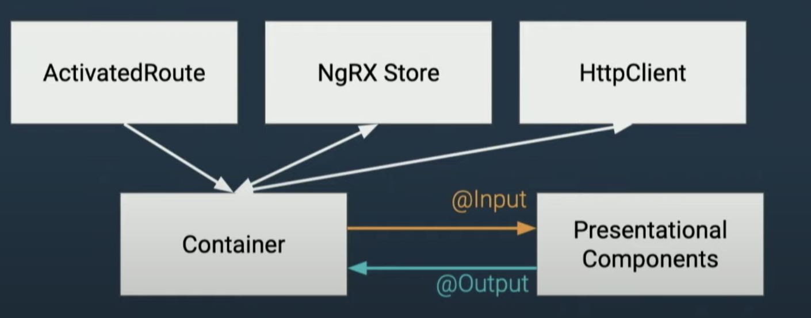

# Arquitectura de Componentes

La mayoría de aplicaciones que construimos no son paginas estáticas, hay un estado y hay diferentes tipos de componentes donde el estado podría vivir. 

### Tipos de Componentes

* Presentational componentes o Componentes de presentación

Muy conocidos como Dumb o componentes tontos. Son stateless o sin estado y usan Inputs/Outputs para su comunicación. Enviamos un valor, renderizamos los valores, emite un evento cuando esta listo y algún otro componente administra el estado y hace las actualizaciones respectivas del estado. 

Con estos componentes nos probamos a nosotros mismos en cuanto a la separación de la complejidad en la lógica que podemos llegar hacer, en estos componentes no hay necesidad de crear servicios mockeados, o hacer alguna petición solo pasamos los inputs, se verifica alguna información de ser necesaria y se emite un output

* Container components o Componentes contenedores

Estos componentes son los Smart o inteligentes. Se encargan de conector los "dumb" al estado de la aplicación. Maneja los eventos emitidos, el de presentación emite un evento, y este  responde a ese evento y se hace los llamados al servidor y actualiza lo necesario para ver los cambios necesarios en la UI o interfaz de usuario. El contenedor es el que controla todo.

* Layout components o componentes de diseño

Para estos no se maneja data, por lo que no es necesario una actualización cuando hay un cambio. Lo podemos ver como una página que tiene una estructura definida, o una plantilla que nos servirá para luego organizar otros componentes.

### Flujo de datos

cuando estamos creando nuestra aplicación podemos ubicar los tres tipos de componentes de la siguiente forma:

Container \(Contenedor\)     -&gt;        Layout \(Diseño\)      -&gt;     Presentational \(Presentación\)

Entre el contenedor y el componente de presentación una forma de compartir la data es mediante Input y Outputs.

 La data viene de una petición como por el HttpClient, una Store \(NgrX\), o una ruta y todo va al contenedor, esas diferentes fuentes van al contenedor y este hace lo que requiere el estado y lo pasa al componente presentacional, para renderizar lo que se necesita. 

Son dos componentes los importantes uno en mostrar el contenido y el otro de manejar la data.

  

